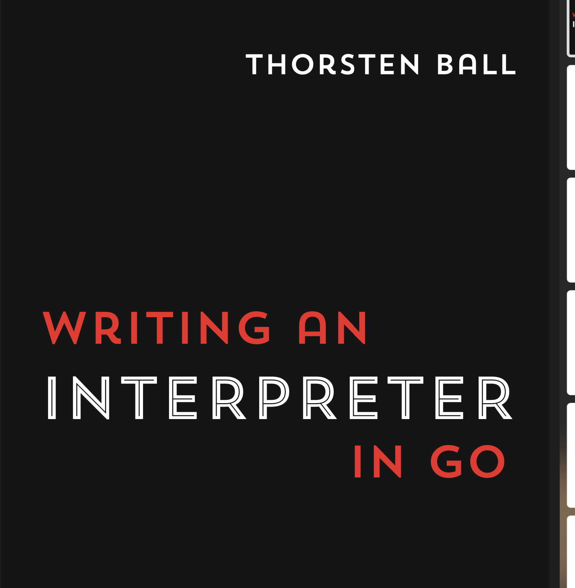
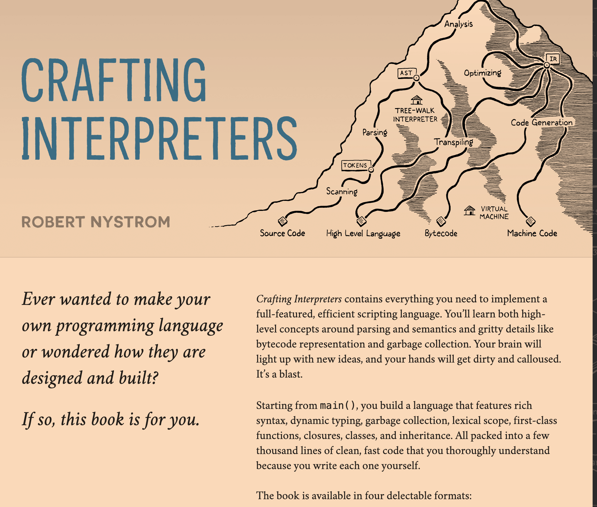

## What is Interpreter

From Wikipedia:

> In computer science, an interpreter is a computer program that directly executes instructions written in a programming or scripting language, without requiring them previously to have been compiled into a machine language program. An interpreter generally uses one of the following strategies for program execution:

> 1. Parse the source code and perform its behavior directly;
> 2. Translate source code into some efficient intermediate representation or object code and immediately execute that;
> 3. Explicitly execute stored precompiled bytecode made by a compiler and matched with the interpreter Virtual Machine.

## Why use Rust to build

I am currently learning rust, and want to use it build something and learning rust by building things.

## Where to start

SO when I start to research how to build a interpreter and want to know how the program was run by the operating system under the hood.

And I searched, found 2 very useful resource below:

- **Writing An Interpreter In Go**

- **craftinginterpreters.com**

And I learned a lot from them about how interpreter works. So I decided use rust to implement the interpter by what I learned from them.

## What is the general Architecture of An Interpreter
