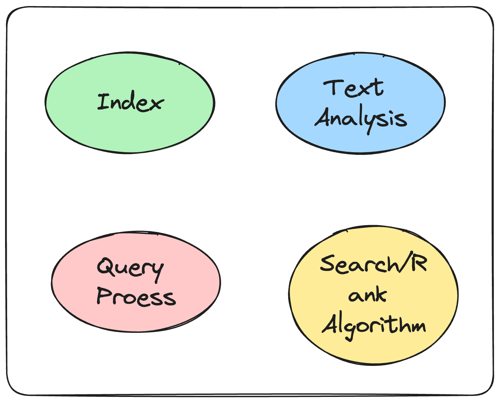
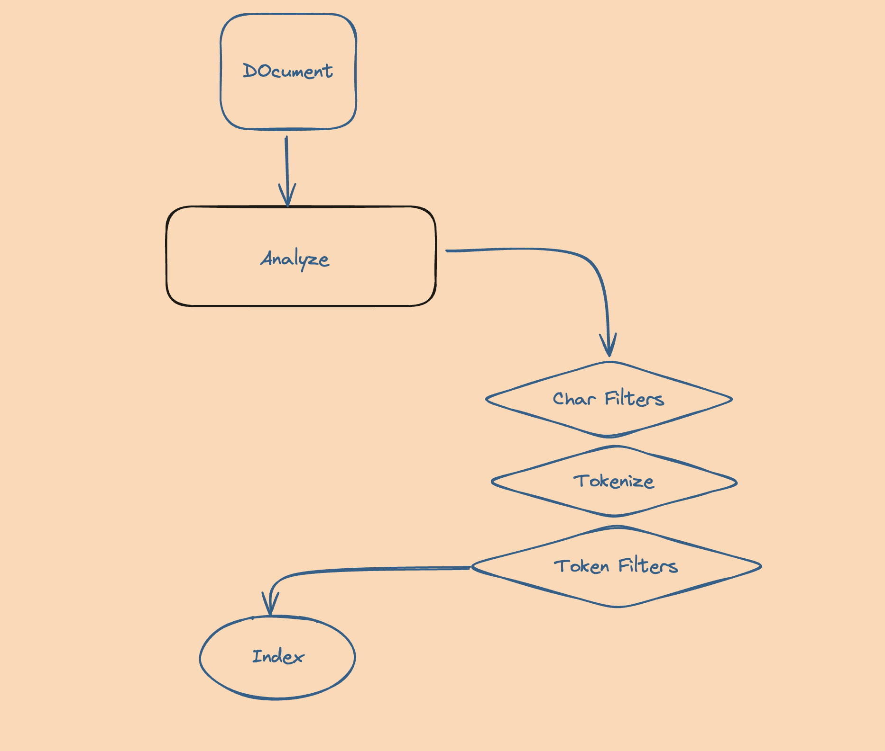

Recently I am start working on build a Full Text Search engine with rust. But I don't know how to get started.
And have many questions:

- What is the basic concept in the full-text search Engine.
- What are the core conponents in the Engine.
- And how they works together.
- How the document/text is analyzed and filtered,
- How the analyzed indexed is stored on the disk.
- How the engine searchs the results according user's query.

After Read about Elastic Search Docuemnts, Melisearch blogs, Couchbase blog, and read some source code from Bleve.

- [How to deliver the best search results: inside a full text search engine](https://blog.meilisearch.com/how-full-text-search-engines-work/)

* [Text Analysis within a Full-Text Search Engine](https://www.couchbase.com/blog/full-text_search_text_analysis/)

- [Anatomy of an analyzer](https://www.elastic.co/guide/en/elasticsearch/reference/current/analyzer-anatomy.html)
- [Mapping](https://www.elastic.co/guide/en/elasticsearch/reference/current/mapping.html)

* [Bleve](https://github.com/blevesearch/bleve)

I have some basic knowledge about full-text search engines.

In this blog post Will first write about the Basic Concept and the Index Steps when index the document.

## The Basic Concept.

### What is Full Text Search

Full-text search refers to **the process of searching a database or collection of text documents for all instances of a word or phrase**. It is a comprehensive way to query text content, as opposed to searching metadata or parts of the original texts. Full-text search is widely used in search engines, document management systems, and databases to quickly find information within large volumes of text data.

**`The core functionality of full-text search allows users to retrieve documents or database records that contain specific words or phrases, regardless of their position within the text`**. This is achieved by indexing the content of the documents, where the index stores the location of words within the documents. When a search query is performed, the search engine looks up the query terms in the index and retrieves the documents that contain those terms.

### The Core Conpoenets in a Full Text Search Engine

Full-text search engines are sophisticated systems designed to efficiently search through large volumes of text data to find matches to user queries. These engines are crucial for navigating the vast amounts of unstructured data that exist today. The components and algorithms behind full-text search engines enable them to provide relevant, accurate search results quickly. Here's an overview of the key components and some of the algorithms that power them:

#### Components of a Full-Text Search Engine



1. **Indexing**: Before a search engine can start searching through documents, it needs to process and organize the data. This is done through indexing. During indexing, the engine scans the text of documents and creates a list of search terms, often called an index or concordance. This index is a data structure that allows for fast searching.

2. **Text Analysis**: This component processes the text to be indexed or searched. It involves several sub-tasks such as tokenization (breaking text into words or terms), stemming (reducing words to their base or root form), and removing stop words (common words like "the" and "and" that are ignored during searching).

3. **Query Processor**: The query processor interprets the user's search query and converts it into a form that can be efficiently executed by the search engine. It handles syntax parsing, spell correction, synonym expansion, and other query enhancements.

4. **Search Algorithm**: Once the query is processed, the search algorithm takes over to find matches in the indexed data. It uses the index to quickly locate documents that contain the terms mentioned in the query.

5. **Ranking Algorithm**: After finding the matching documents, the search engine needs to rank them according to their relevance to the query. This is where ranking algorithms come into play, evaluating factors like term frequency, document length, and term proximity.

#### Algorithms Behind Full-Text Search Engines

1. **Boolean Retrieval Model**: This is one of the simplest models, where the search query is expressed using Boolean operators (AND, OR, NOT). It's effective for precise queries but lacks the nuance of ranking results by relevance.

2. **Vector Space Model (VSM)**: In VSM, documents and queries are represented as vectors in a multi-dimensional space. The relevance of a document to a query is determined by the cosine similarity between their vectors. This model allows for ranking results based on how closely they match the query.

3. **TF-IDF (Term Frequency-Inverse Document Frequency)**: This is a statistical measure used to evaluate how important a word is to a document in a collection or corpus. It's often used in conjunction with VSM to calculate the weight of terms in documents and queries.

4. **PageRank**: Developed by Google, PageRank is a link analysis algorithm used to rank web pages in search engine results. While not a full-text search algorithm per se, it's an important component of web search engines, determining the importance of documents based on the link structure of the web.

5. **BM25**: A more advanced ranking function that builds upon the probabilistic retrieval model. It considers term frequency, document length, and other factors to rank documents. BM25 is known for its effectiveness in handling the variability of term importance across different documents.

In summary, full-text search engines are complex systems that rely on a combination of text processing, indexing, and sophisticated algorithms to provide fast and relevant search results. The components work together to handle the challenges of searching through vast amounts of unstructured text data, while the algorithms ensure that the results are ranked by relevance to the user's query.

## Step 1: Index

The indexing process will scan the document, and apply the Analyzers, Tokenize, Filters on the Text.
And finnaly produce the index.



### Index Example with Bleve

```go
messages := []struct {
		Id   string
		From string
		Body string
	}{
		{
			Id:   "index-example1",
			From: "forfd8960",
			Body: "test with bleve indexing",
		},
		{
			Id:   "index-example2",
			From: "forfd8960",
			Body: "another document",
		},
	}

	mapping := bleve.NewIndexMapping()
	index, err := bleve.New("example.bleve", mapping)
	if err != nil {
		panic(err)
	}

	for _, msg := range messages {
		if err := index.Index(msg.Id, msg); err != nil {
			fmt.Printf("index err: %v\n", err)
			return
		}
	}

	fmt.Printf("index: %v has been successful build\n", index)
```

- 1. define a set of messages(data)

```go
messages := []struct {
		Id   string
		From string
		Body string
	}{
		{
			Id:   "index-example1",
			From: "forfd8960",
			Body: "test with bleve indexing",
		},
		{
			Id:   "index-example2",
			From: "forfd8960",
			Body: "another document",
		},
	}
```

- 2. create index with the default mapping

```go
mapping := bleve.NewIndexMapping()
index, err := bleve.New("example.bleve", mapping)
```

- 3. Index the msg

```go
index.Index(msg.Id, msg)
```

- 4. What happened in the `index.Index` function.

     4.1 first call indexImpl.Index

  ```go
  func (i *indexImpl) Index(id string, data interface{}) (err error) {
  ```

  4.2 New a Document

  ```go
  ...
  if !i.open {
    return ErrorIndexClosed
  }

  /*
  *github.com/blevesearch/bleve/document.Document {
  ID: "index-example1",
  Fields: []github.com/blevesearch/bleve/document.Field len: 0, cap: 0, [],
  CompositeFields: []*github.com/blevesearch/bleve/document.CompositeField len: 0, cap: 0, [],}
  */
  doc := document.NewDocument(id)
  ...
  ```

  4.3 call `MapDocument` with doc and data.

  ```go
  err = i.m.MapDocument(doc, data)
  ```

  4.4 MapDocument implement details

  ```go
  // github.com/blevesearch/bleve/mapping.(*IndexMappingImpl).MapDocument()
  func (im *IndexMappingImpl) MapDocument(doc *document.Document, data interface{}) error {...}
  ```

  4.4.1 get `docType` and `docMapping`

  ```go
  docType := im.determineType(data)
  docMapping := im.mappingForType(docType)
  /*
  (dlv) p docType
  "_default"
  (dlv) p docMapping
  ("*github.com/blevesearch/bleve/mapping.DocumentMapping")(0x140003ba140)
  *github.com/blevesearch/bleve/mapping.DocumentMapping {
      Enabled: true,
      Dynamic: true,
      Properties: map[string]*github.com/blevesearch/bleve/mapping.DocumentMapping nil,
      Fields: []*github.com/blevesearch/bleve/mapping.FieldMapping len: 0, cap: 0, nil,
      DefaultAnalyzer: "",
      StructTagKey: "",}
  */
  ```

  4.4.2 call `walkDocument`

  ```go
  walkContext := im.newWalkContext(doc, docMapping)
  docMapping.walkDocument(data, []string{}, []uint64{}, walkContext)

  /*
  (dlv) p walkContext
  ("*github.com/blevesearch/bleve/mapping.walkContext")(0x140003eacc0)
  *github.com/blevesearch/bleve/mapping.walkContext {
  	doc: *github.com/blevesearch/bleve/document.Document {
  		ID: "index-example1",
  		Fields: []github.com/blevesearch/bleve/document.Field len: 0, cap: 0, [],
  		CompositeFields: []*github.com/blevesearch/bleve/document.CompositeField len: 0, cap: 0, [],},
  	im: *github.com/blevesearch/bleve/mapping.IndexMappingImpl {
  		TypeMapping: map[string]*github.com/blevesearch/bleve/mapping.DocumentMapping [],
  		DefaultMapping: *(*"github.com/blevesearch/bleve/mapping.DocumentMapping")(0x140003ba140),
  		TypeField: "_type",
  		DefaultType: "_default",
  		DefaultAnalyzer: "standard",
  		DefaultDateTimeParser: "dateTimeOptional",
  		DefaultField: "_all",
  		StoreDynamic: true,
  		IndexDynamic: true,
  		DocValuesDynamic: true,
  		CustomAnalysis: *(*"github.com/blevesearch/bleve/mapping.customAnalysis")(0x14000199b90),
  		cache: *(*"github.com/blevesearch/bleve/registry.Cache")(0x140003ba190),},
  	dm: *github.com/blevesearch/bleve/mapping.DocumentMapping {
  		Enabled: true,
  		Dynamic: true,
  		Properties: map[string]*github.com/blevesearch/bleve/mapping.DocumentMapping nil,
  		Fields: []*github.com/blevesearch/bleve/mapping.FieldMapping len: 0, cap: 0, nil,
  		DefaultAnalyzer: "",
  		StructTagKey: "",},
  	excludedFromAll: []string len: 1, cap: 1, ["_id"],}

    (dlv) p walkContext.im.CustomAnalysis
        ("*github.com/blevesearch/bleve/mapping.customAnalysis")(0x14000199b90)
        *github.com/blevesearch/bleve/mapping.customAnalysis {
        CharFilters: map[string]map[string]interface {} [],
        Tokenizers: map[string]map[string]interface {} [],
        TokenMaps: map[string]map[string]interface {} [],
        TokenFilters: map[string]map[string]interface {} [],
        Analyzers: map[string]map[string]interface {} [],
        DateTimeParsers: map[string]map[string]interface {} [],}

    */
  ```

  4.4.3 `walkDocument` Details.

  ```go
  // github.com/blevesearch/bleve/mapping.(*DocumentMapping).walkDocument()
  func (dm *DocumentMapping) walkDocument(data interface{}, path []string, indexes []uint64, context *walkContext) {

    ...
    // step1 reflect the type of the data(current the data is a struct)
    val := reflect.ValueOf(data)
  if !val.IsValid() {
  	return
  }

    // step2 go thourgh every field of the struct, and call `dm.processProperty(fieldVal, newpath, indexes, context)`
  typ := val.Type()
  switch typ.Kind() {
        ...
        case reflect.Struct:
            for i := 0; i < val.NumField(); i++ {
                field := typ.Field(i)
                fieldName := field.Name
                // anonymous fields of type struct can elide the type name
                if field.Anonymous && field.Type.Kind() == reflect.Struct {
                    fieldName = ""
                }

                // if the field has a name under the specified tag, prefer that
                tag := field.Tag.Get(structTagKey)
                tagFieldName := parseTagName(tag)
                if tagFieldName == "-" {
                    continue
                }
                // allow tag to set field name to empty, only if anonymous
                if field.Tag != "" && (tagFieldName != "" || field.Anonymous) {
                    fieldName = tagFieldName
                }

                if val.Field(i).CanInterface() {
                    fieldVal := val.Field(i).Interface()
                    newpath := path
                    if fieldName != "" {
                        newpath = append(path, fieldName)
                    }
                    dm.processProperty(fieldVal, newpath, indexes, context)
                }
            }
        ...
    }
  }
  ```

  4.4.4 `processProperty`
  In this step, will call different `newXXXFieldMappingDynamic` acccording the field type from struct.

  Since the first Field(`Id`) of docuemnt is a String, So will call `newTextFieldMappingDynamic`

  ```go
  // github.com/blevesearch/bleve/mapping.(*DocumentMapping).processProperty()
  func (dm *DocumentMapping) processProperty(property interface{}, path []string, indexes []uint64, context *walkContext) {
      ...
            else if closestDocMapping.Dynamic {
                // automatic indexing behavior

                // first see if it can be parsed by the default date parser
                dateTimeParser := context.im.DateTimeParserNamed(context.im.DefaultDateTimeParser)
                if dateTimeParser != nil {
                    parsedDateTime, layout, err := dateTimeParser.ParseDateTime(propertyValueString)
                    if err != nil {
                        // index as text
                        fieldMapping := newTextFieldMappingDynamic(context.im)
                        fieldMapping.processString(propertyValueString, pathString, path, indexes, context)
                    } else {
                        // index as datetime
                        fieldMapping := newDateTimeFieldMappingDynamic(context.im)
                        fieldMapping.processTime(parsedDateTime, layout, pathString, path, indexes, context)
                    }
                }
            }
        ...
  }
  ```

  4.4.5 `processString`

  ```
  step1: Get field analyzer
  step2: New document Text Field
  step3: Add field to docuement.
  ```

  ```go
  func (fm *FieldMapping) processString(propertyValueString string, pathString string, path []string, indexes []uint64, context *walkContext) {
    fieldName := getFieldName(pathString, path, fm) // Id
    options := fm.Options() // DefaultCompositeIndexingOptions|StoreField|IncludeTermVectors|DocValues (15)
    if fm.Type == "text" {
        analyzer := fm.analyzerForField(path, context)
        /*
        ("*github.com/blevesearch/bleve/analysis.Analyzer")(0x14000280340)
        *github.com/blevesearch/bleve/analysis.Analyzer {
            CharFilters: []github.com/blevesearch/bleve/analysis.CharFilter len: 0, cap: 0, nil,
            Tokenizer: github.com/blevesearch/bleve/analysis.Tokenizer(*github.com/blevesearch/bleve/analysis/tokenizer/unicode.UnicodeTokenizer) *{},
            TokenFilters: []github.com/blevesearch/bleve/analysis.TokenFilter len: 2, cap: 2, [
                ...,
                ...,
            ],}
        */
        field := document.NewTextFieldCustom(fieldName, indexes, []byte(propertyValueString), options, analyzer)
        /*
           (dlv) p field
                ("*github.com/blevesearch/bleve/document.TextField")(0x140004180c0)
                *github.com/blevesearch/bleve/document.TextField {
                    name: "Id",
                    arrayPositions: []uint64 len: 0, cap: 0, [],
                    options: DefaultCompositeIndexingOptions|StoreField|IncludeTermVectors|DocValues (15),
                    analyzer: *github.com/blevesearch/bleve/analysis.Analyzer {
                        CharFilters: []github.com/blevesearch/bleve/analysis.CharFilter len: 0, cap: 0, nil,
                        Tokenizer: github.com/blevesearch/bleve/analysis.Tokenizer(*github.com/blevesearch/bleve/analysis/tokenizer/unicode.UnicodeTokenizer) ...,
                        TokenFilters: []github.com/blevesearch/bleve/analysis.TokenFilter len: 2, cap: 2, [
                            ...,
                            ...,
                        ],},
                    value: []uint8 len: 14, cap: 16, [105,110,100,101,120,45,101,120,97,109,112,108,101,49],
                    numPlainTextBytes: 14,}
        */
        context.doc.AddField(field)

        /*
        (dlv) p context.doc.Fields
        []github.com/blevesearch/bleve/document.Field len: 1, cap: 1, [
            *github.com/blevesearch/bleve/document.TextField {
                name: "Id",
                arrayPositions: []uint64 len: 0, cap: 0, [],
                options: DefaultCompositeIndexingOptions|StoreField|IncludeTermVectors|DocValues (15),
                analyzer: *(*"github.com/blevesearch/bleve/analysis.Analyzer")(0x14000280340),
                value: []uint8 len: 14, cap: 16, [105,110,100,101,120,45,101,120,97,109,112,108,101,49],
                numPlainTextBytes: 14,},
        ]
        */
        if !fm.IncludeInAll {
            context.excludedFromAll = append(context.excludedFromAll, fieldName)
        }
    }
  }
  ```

  4.4.2 Back to `walkDocuemnt` and get all Docuemnt Fields from a Struct

```go
(dlv) p context.doc.Fields
[]github.com/blevesearch/bleve/document.Field len: 3, cap: 4, [
	*github.com/blevesearch/bleve/document.TextField {
		name: "Id",
		arrayPositions: []uint64 len: 0, cap: 0, [],
		options: DefaultCompositeIndexingOptions|StoreField|IncludeTermVectors|DocValues (15),
		analyzer: *(*"github.com/blevesearch/bleve/analysis.Analyzer")(0x14000280340),
		value: []uint8 len: 14, cap: 16, [105,110,100,101,120,45,101,120,97,109,112,108,101,49],
		numPlainTextBytes: 14,},
	*github.com/blevesearch/bleve/document.TextField {
		name: "From",
		arrayPositions: []uint64 len: 0, cap: 0, [],
		options: DefaultCompositeIndexingOptions|StoreField|IncludeTermVectors|DocValues (15),
		analyzer: *(*"github.com/blevesearch/bleve/analysis.Analyzer")(0x14000280340),
		value: []uint8 len: 20, cap: 24, [102,111,114,102,100,56,57,54,48,64,103,105,116,104,117,98,46,99,111,109],
		numPlainTextBytes: 20,},
	*github.com/blevesearch/bleve/document.TextField {
		name: "Body",
		arrayPositions: []uint64 len: 0, cap: 0, [],
		options: DefaultCompositeIndexingOptions|StoreField|IncludeTermVectors|DocValues (15),
		analyzer: *(*"github.com/blevesearch/bleve/analysis.Analyzer")(0x14000280340),
		value: []uint8 len: 24, cap: 24, [116,101,115,116,32,119,105,116,104,32,98,108,101,118,101,32,105,110,100,101,120,105,110,103],
		numPlainTextBytes: 24,},
]
```

4.5 Update the doc

```go
err = i.i.Update(doc)
```

4.5.1 index `i.i.Update`

path: `github.com/blevesearch/bleve/index/upsidedown.(*UpsideDownCouch).Update()`

```go
func (udc *UpsideDownCouch) Update(doc *document.Document) (err error) {
    ...

    // step1: put the analysis work on the queue
    aw := index.NewAnalysisWork(udc, doc, resultChan)
    udc.analysisQueue.Queue(aw)
    ...

    // step2: get the analyzed result
    /*
        (dlv) p result
            ("*github.com/blevesearch/bleve/index.AnalysisResult")(0x14000504000)
            *github.com/blevesearch/bleve/index.AnalysisResult {
                DocID: "index-example1",
                Rows: []github.com/blevesearch/bleve/index.IndexRow len: 22, cap: 22, [
                    ...,
                    ...,
                    ...,
                    ...,
                    ...,
                    ...,
                    ...,
                    ...,
                    ...,
                    ...,
                    ...,
                    ...,
                    ...,
                    ...,
                    ...,
                    ...,
                    ...,
                    ...,
                    ...,
                    ...,
                    ...,
                    ...,
                ],
                Document: *github.com/blevesearch/bleve/document.Document nil,
                Analyzed: []github.com/blevesearch/bleve/analysis.TokenFrequencies len: 0, cap: 0, nil,
                Length: []int len: 0, cap: 0, nil,}
    */
    // step3; update the analyzed rows to key-value store
    return udc.UpdateWithAnalysis(doc, result, backIndexRow)
}
```

4.5.2 `UpdateWithAnalysis`

step1: get the kvwriter.
step2:

```go
func (udc *UpsideDownCouch) UpdateWithAnalysis(doc *document.Document, result *index.AnalysisResult, backIndexRow *BackIndexRow) (err error) {
    ...
    // step1: get the kvwriter.
    kvwriter, err = udc.store.Writer()
    ...

    // stpe2: udc.mergeOldAndNew
    /*
        (dlv) p addRowsAll[0][0]
            github.com/blevesearch/bleve/index/upsidedown.UpsideDownCouchRow(*github.com/blevesearch/bleve/index/upsidedown.FieldRow) *{index: 0, name: "Id"}
        (dlv) p addRowsAll[0][1]
            github.com/blevesearch/bleve/index/upsidedown.UpsideDownCouchRow(*github.com/blevesearch/bleve/index/upsidedown.StoredRow) *{
                doc: []uint8 len: 14, cap: 16, [105,110,100,101,120,45,101,120,97,109,112,108,101,49],
                field: 0,
                arrayPositions: []uint64 len: 0, cap: 0, [],
                typ: 116,
                value: []uint8 len: 14, cap: 16, [105,110,100,101,120,45,101,120,97,109,112,108,101,49],}
        (dlv) p string(addRowsAll[0][1].value)
            "index-example1"

        (dlv) p updateRowsAll
            [][]github.com/blevesearch/bleve/index/upsidedown.UpsideDownCouchRow len: 0, cap: 0, nil
        (dlv) p deleteRowsAll
            [][]github.com/blevesearch/bleve/index/upsidedown.UpsideDownCouchRow len: 0, cap: 0, nil

    */
    addRows, updateRows, deleteRows := udc.mergeOldAndNew(backIndexRow, result.Rows)

    // stpe3: write rows to key-value store
    err = udc.batchRows(kvwriter, addRowsAll, updateRowsAll, deleteRowsAll)
}
```
