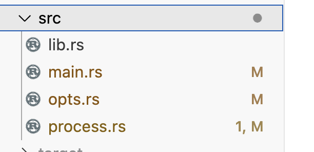

## use clap to build a cli App

So, I want to build a Cli App that convert a csv file to json, yaml, toml formated file.

And for Rust, there is crate `clap` was used to build cli app.

And the final command to use the cli app, is something like this:

```sh
./target/debug/rcli csv -i test.csv
```

<!-- truncate -->

## Init the app

```sh
cargo new --bin rcli
```

## Add the dependency

```sh
cargo add clap --features derive
```

## The code structure



there are 4 file under the src:

- `lib.rs`: expose the opts and process module to let main can use them.
- `opts.rs`: define the command line arguments and handle covert to internal data structure.
- `process.rs`: read csv file and write to different format file from csv.
- `main.rs`: cli app entry.
