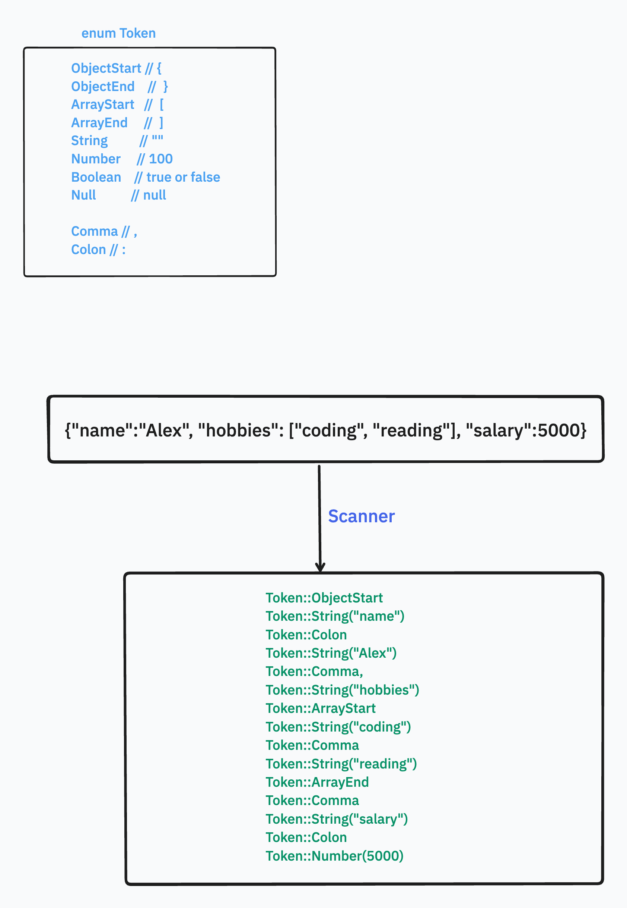

## What is Json

[What is Json](https://www.json.org/json-en.html)

> JSON (JavaScript Object Notation) is a lightweight data-interchange format. It is easy for humans to read and write. It is easy for machines to parse and generate. It is based on a subset of the JavaScript Programming Language Standard ECMA-262 3rd Edition - December 1999.

<!-- truncate -->

## What's the element in a Json

A json looks like:

```json
{
    "name": "Alex",
    "age": 30,
    "hobbies": ["coding", "reading", "music"],
    "isStudent": false,
    "address": {
        "street": "123 Main St",
        "city": "New York",
        "zip": "10001",
        "country": "USA",
        "phone": "123-456-7890"
    }
}
```

In the Json, there will be 6 types of elements.

- Object
- Array
- String
- Number
- Boolean
- Null

## Scan json into Tokens

first use scanner to scan the json text and group the chars into different Tokens.



### The Token

```rust
#[derive(Debug, Clone, PartialEq)]
pub enum Token {
    Number(f64),
    String(String),
    Boolean(bool),
    ArrayStart,  // [
    ArrayEnd,    // ]
    ObjectStart, // {
    ObjectEnd,   // }
    Null,
    NewLine, // \r \n \t 
    Comma, //,
    Colon, // :
}
```

### The Scanner

```rust
pub struct Scanner {
    pub chars: Vec<char>, // the chars in the json text
    pub start: usize, // the start 
    pub current: usize, // current index
}
```

### Scan Tokens

```rust
fn scan_token(&mut self) -> Result<Token, LexerError> {
        let cur = self.advance();

        // let mut tokens: Vec<Token> = vec![];
        match cur {
            '{' => Ok(Token::ObjectStart),
            '}' => Ok(Token::ObjectEnd),
            '[' => Ok(Token::ArrayStart),
            ']' => Ok(Token::ArrayEnd),
            ':' => Ok(Token::Colon),
            ',' => Ok(Token::Comma),
            '"' => Ok(self.scan_string()?),
            '\n' | '\t' | '\r' | ' ' => Ok(Token::NewLine),
            _ => {
                if cur.is_numeric() {
                    return Ok(self.scan_number()?);
                } else if cur.is_alphabetic() {
                    return Ok(self.scan_identifier()?);
                } else {
                    return Err(LexerError::InvalidChar);
                }
            }
        }
    }
```

### Scan String

```rust
fn scan_string(&mut self) -> Result<Token, LexerError> {
        let mut s = String::new();

        while let Some(c) = self.peek() {
            if c == '"' || self.is_at_end() {
                break;
            }

            self.advance();
        }

        if self.is_at_end() {
            return Err(LexerError::InvalidString("unterminated string".to_string()));
        }

        self.advance();
        for c in self.chars[self.start + 1..self.current - 1].iter() {
            s.push(*c);
        }
        Ok(Token::String(s))
    }
```

### Scan number

```rust
fn scan_number(&mut self) -> Result<Token, LexerError> {
        self.peek_number();

        let s: String = self.chars[self.start..self.current].iter().collect();
        match s.parse::<f64>() {
            Ok(n) => Ok(Token::Number(n)),
            Err(_) => Err(LexerError::InvalidNumber(s)),
        }
    }

    fn peek_number(&mut self) {
        while let Some(c) = self.peek() {
            if !c.is_numeric() {
                break;
            }

            self.advance();
        }

        let cur = self.peek();
        if cur.is_none() {
            return;
        }

        if cur.unwrap() != '.' {
            return;
        }

        if let Some(c_n) = self.peek_next() {
            if !c_n.is_numeric() {
                return;
            }

            self.advance();

            while let Some(cc) = self.peek() {
                if !cc.is_numeric() {
                    break;
                }
                self.advance();
            }
        }
    }
```

### Scan Identifier

```rust
fn scan_identifier(&mut self) -> Result<Token, LexerError> {
        while let Some(c) = self.peek() {
            if !c.is_alphanumeric() {
                break;
            }
            self.advance();
        }

        let text: String = self.chars[self.start..self.current].iter().collect();
        match text.as_str() {
            "null" => Ok(Token::Null),
            "true" => Ok(Token::Boolean(true)),
            "false" => Ok(Token::Boolean(false)),
            _ => Err(LexerError::InvalidIdent(text)),
        }
    }
```

## Parse Tokens into Json

Parser consumes the Tokens, and Parse them into Json.

```rust
pub struct Parser {
    tokens: Vec<Token>,
    index: usize,
}
```

For a Json, it will be a Json Object or Json Array. So the start of valid Json is either `{` or `[`.

```rust
pub fn parse(&mut self) -> Result<Json, ParserError> {
        let mut result = Json::Null;
        while !self.is_end() {
            let current = self.current();

            match current {
                Token::ObjectStart => {
                    println!("object start...");
                    result = self.parse_object()?;
                }
                Token::ArrayStart => {
                    println!("array start...");
                    result = self.parse_array()?;
                }
                _ => {
                    return Err(ParserError::InvalidToken(format!(
                        "invalid token: {:?}",
                        self.tokens[self.index]
                    )));
                }
            }
        }

        Ok(result)
}
```

### Parse Json Object

- Consume the ObjectStart: `{`
- Parse the key-value pairs.
- Consume Comma if the next token is not `}`.
- Consume the ObjectEnd: `}`


```rust
fn parse_object(&mut self) -> Result<Json, ParserError> {
        self.consume(Token::ObjectStart, "expected object start: {".to_string())?;

        let mut object: HashMap<String, Json> = HashMap::new();
        while !self.check(Token::ObjectEnd) {
            let key = self.consume(Token::String("".to_string()), "expected string".to_string())?;

            self.consume(Token::Colon, "expected colon".to_string())?;

            let value = self.parse_value()?;

            if let Token::String(key_val) = key {
                object.insert(key_val, value);
            } else {
                return Err(ParserError::InvalidToken(format!(
                    "expected string, got {:?}",
                    key
                )));
            }

            if self.check(Token::ObjectEnd) {
                break;
            }
            self.consume(Token::Comma, "expected comma".to_string())?;
        }

        self.consume(Token::ObjectEnd, "expected object end:}".to_string())?;
        Ok(Json::Object(object))
    }
```

### Parse Json Array

- Consume the ArrayStart: `[`.
- Parse the values if not meet the ArrayEnd: `]`.
- Break the loop if meet the ArrayEnd: `]`.
- Consume the ArrayEnd: `]`.

```rust
fn parse_array(&mut self) -> Result<Json, ParserError> {
        self.consume(Token::ArrayStart, "expected array start: [".to_string())?;

        let mut array = Vec::new();
        while !self.check(Token::ArrayEnd) {
            let value = self.parse_value()?;
            array.push(value);

            if self.check(Token::ArrayEnd) {
                break;
            }

            self.consume(Token::Comma, "expected comma".to_string())?;
        }

        self.consume(Token::ArrayEnd, "expected array end: ]".to_string())?;
        Ok(Json::Array(array))
}
```

### Parse Json Value

- Check current Token.
- IF the token is String, then return the String.
- IF the token is Number, then return the Number.
- IF the token is Boolean, then return the Boolean.
- IF the token is Null, then return the Null.
- IF the token is ObjectStart, then parse the Object.
- IF the token is ArrayStart, then parse the Array.

```rust
fn parse_value(&mut self) -> Result<Json, ParserError> {
        let current = self.current();
        println!("current: {:?}", current);
        match current {
            Token::String(s) => {
                self.advance();
                Ok(Json::String(s))
            }
            Token::Number(n) => {
                self.advance();
                Ok(Json::Number(n))
            }
            Token::Boolean(b) => {
                self.advance();
                Ok(Json::Boolean(b))
            }
            Token::Null => {
                self.advance();
                Ok(Json::Null)
            }
            Token::ObjectStart => self.parse_object(),
            Token::ArrayStart => self.parse_array(),
            _ => Err(ParserError::InvalidToken(format!(
                "invalid token: {:?}",
                self.tokens[self.index]
            ))),
        }
}
```

## Put it all together

// src/lib.rs

```rust
use errors::ParserError;
use parser::parser::Parser;
use parser::Json;
use scanner::Scanner;

mod errors;
mod parser;
mod scanner;
mod token;

pub fn parse_json(json: &str) -> Result<Json, ParserError> {
    match Scanner::new(json.to_string()).scan() {
        Ok(tokens) => Parser::new(tokens).parse(),
        Err(e) => Err(ParserError::InvalidJson(e.to_string())),
    }
}

```

## Test

Now we can see, we can parse the json text to Json.

```rust
use json_parser_rs::parse_json;

fn main() {
    let my_json = r#"{"name":"Alex", "age": 30, "job":"Software Engineer"}"#;
    let json = parse_json(my_json).unwrap();
    // parsed json: Object({"name": String("Alex"), "job": String("Software Engineer"), "age": Number(30.0)})
    println!("parsed json: {:?}", json);

    let my_json1 = r#"{"list":[1,3,6,9,100]}"#;
    let json = parse_json(my_json1).unwrap();
    // parsed json: Object({"list": Array([Number(1.0), Number(3.0), Number(6.0), Number(9.0), Number(100.0)])})
    println!("parsed json: {:?}", json);

    let my_json2 = r#"[1,3,6,9,100]"#;
    let json = parse_json(my_json2).unwrap();
    // parsed json: Array([Number(1.0), Number(3.0), Number(6.0), Number(9.0), Number(100.0)])
    println!("parsed json: {:?}", json);

    let idea_list = r#"{"ideas":[{"id":1,"title":"idea1","content":"content1","created_at":"2023-07-01T00:00:00Z","updated_at":"2023-07-01T00:00:00Z"},{"id":2,"title":"idea2","content":"content2","created_at":"2023-07-01T00:00:00Z","updated_at":"2023-07-01T00:00:00Z"}]}"#;
    let idea_list_json = parse_json(idea_list).unwrap();

    // parsed json: Object({"ideas": Array([Object({"created_at": String("2023-07-01T00:00:00Z"), "content": String("content1"), "title": String("idea1"), "updated_at": String("2023-07-01T00:00:00Z"), "id": Number(1.0)}), Object({"updated_at": String("2023-07-01T00:00:00Z"), "title": String("idea2"), "id": Number(2.0), "content": String("content2"), "created_at": String("2023-07-01T00:00:00Z")})])})
    println!("parsed json: {:?}", idea_list_json);
}
```

## Code Repo

- [json-parser-rs](https://github.com/forfd8960/json-parser-rs)
