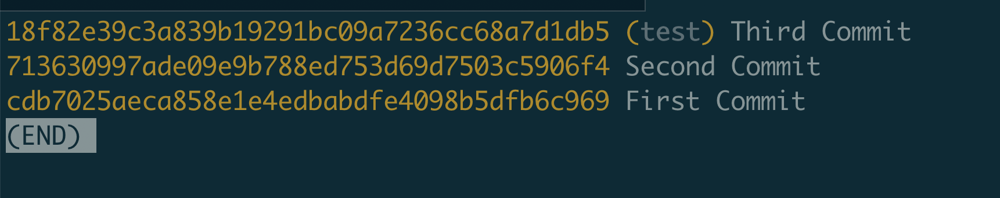

## The internals want to know about Git

We as developers often use git to manage our code. But do you know how git works?

And as a Curious developer, I want to know how git works.

Some questions I want to know are:

* How git stores the data(the code, the image etc)
* What happens when run `git add`
* How does git knowns which file is untracked.
* Where does the data is been stored.
* How git store the commit when you run `git commit -m "message"`
* How git restore the repo when checkout to another branch.

<!-- truncate -->

After reading many blogs and article about git. I learned some internals of git.

## Git is a content-addressable filesystem

Git is a content-addressable filesystem. It means that it stores data in a way that allows you to retrieve it later using a hash of the data itself. This is in contrast to a traditional filesystem, which stores data in a way that allows you to retrieve it later using a path to the data.

Git uses a hash function to generate a unique identifier for each piece of data it stores. This identifier is called a "blob" in Git terminology. When you add a file to Git, it generates a blob for the file's contents and stores it in the repository. When you later want to retrieve the file, Git can use the blob's hash to find the data.

## The git directory

The git directory is where Git stores all of its data. It is located in the `.git` directory in the root of your repository. The git directory contains several subdirectories, each of which stores a different type of data.

```shell
tree .git
.git
├── HEAD
├── config
├── description
├── hooks
│   ├── applypatch-msg.sample
│   ├── commit-msg.sample
│   ├── fsmonitor-watchman.sample
│   ├── post-update.sample
│   ├── pre-applypatch.sample
│   ├── pre-commit.sample
│   ├── pre-merge-commit.sample
│   ├── pre-push.sample
│   ├── pre-rebase.sample
│   ├── pre-receive.sample
│   ├── prepare-commit-msg.sample
│   ├── push-to-checkout.sample
│   └── update.sample
├── info
│   └── exclude
├── objects
│   ├── info
│   └── pack
└── refs
    ├── heads
    └── tags

8 directories, 17 files
```

* the `HEAD` and (yet to be created) `index` files, and the `objects` and `refs` directories. These are the core parts of Git.
* The `objects` directory stores all the content for your database. 
* The `refs` directory stores pointers into commit objects in that data (branches, tags, remotes and more).
* the `HEAD` file points to the branch you currently have checked out.
* and the `index` file is where Git stores your staging area information.

## File types

### Blob: BInary Large Object -> Data

In `git`, the contents of files are stored in objects called **blobs**, binary large objects.

**Blobs** on the other hand, are just contents — binary streams of data. A **blob** doesn’t register its creation date, its name, or anything but its contents.

Every **blob** in `git` is identified by its [SHA-1 hash](https://en.wikipedia.org/wiki/SHA-1). SHA-1 hashes consist of 20 bytes, usually represented by 40 characters in hexadecimal form.

### Tree: Pointer to files, content, other Trees.

A **tree** is basically a directory listing, referring to **blobs** as well as other **trees**.

**Trees** are identified by their SHA-1 hashes as well. Referring to these objects, either **blobs** or other **trees**, happens via the SHA-1 hash of the objects.

```sh
git cat-file -p 9a8f8cfb359e7a106b96c749c69aa13a5e74a09a
100644 blob ea8c4bf7f35f6f77f75d92ad8ce8349f6e81ddba	.gitignore
100644 blob 2373d25e28b1fa10d1e9cee7b0380860b59451f4	Cargo.toml
100644 blob c83c092da787cf77f810b961909987b55ccf8db9	README.md
040000 tree 305157a396c6858705a9cb625bab219053264ee4	src
```

### Commit:  Pointer to a tree of changes.

Stored as Objects on the filesystem.

In `git`, a snapshot is a **commit**. A **commit** object includes a pointer to the main **tree** (the root directory), as well as other meta-data such as the **committer**, a **commit** message and the **commit** time.

Every **commit **holds the *entire snapshot*, not just diffs from the previous **commit(s)**.

### Tag, Branch

* Porinter to commits.
* A Name for the a commit.

## Plumbing and Porcelain

[Git - Plumbing and Porcelain (git-scm.com)](https://git-scm.com/book/en/v2/Git-Internals-Plumbing-and-Porcelain#)

But because Git was initially a toolkit for a version control system rather than a full user-friendly VCS, it has a number of subcommands that do low-level work and were designed to be chained together UNIX-style or called from scripts. These commands are generally referred to as Git’s `plumbing` commands, while the more user-friendly commands are called `porcelain` commands.

When you run `git init` in a new or existing directory, Git creates the `.git` directory, which is where almost everything that Git stores and manipulates is located. If you want to back up or clone your repository, copying this single directory elsewhere gives you nearly everything you need. This entire chapter basically deals with what you can see in this directory. Here’s what a newly-initialized `.git` directory typically looks like:

```sh
tree .git
.git
├── HEAD
├── config
├── description
├── hooks
│   ├── applypatch-msg.sample
│   ├── commit-msg.sample
│   ├── fsmonitor-watchman.sample
│   ├── post-update.sample
│   ├── pre-applypatch.sample
│   ├── pre-commit.sample
│   ├── pre-merge-commit.sample
│   ├── pre-push.sample
│   ├── pre-rebase.sample
│   ├── pre-receive.sample
│   ├── prepare-commit-msg.sample
│   ├── push-to-checkout.sample
│   └── update.sample
├── info
│   └── exclude
├── objects
│   ├── info
│   └── pack
└── refs
    ├── heads
    └── tags

8 directories, 17 files
```

the `HEAD` and (yet to be created) `index` files, and the `objects` and `refs` directories. These are the core parts of Git. 

* The `objects` directory stores all the content for your database, 
* The `refs` directory stores pointers into commit objects in that data (branches, tags, remotes and more)
* the `HEAD` file points to the branch you currently have checked out
* and the `index` file is where Git stores your staging area information

## Git Objects

```sh
find .git/objects -type f

➜  how-git-works git:(main) echo 'Hello, Git' | git hash-object -w --stdin
b7aec520dec0a7516c18eb4c68b64ae1eb9b5a5e

➜  how-git-works git:(main) tree .git
.git
├── HEAD
├── config
├── description
├── info
│   └── exclude
├── objects
│   ├── b7
│   │   └── aec520dec0a7516c18eb4c68b64ae1eb9b5a5e
│   ├── info
│   └── pack
└── refs
    ├── heads
    └── tags

8 directories, 5 files


➜  how-git-works git:(main) git cat-file -t b7aec520
blob
➜  how-git-works git:(main) git cat-file -p b7aec520
Hello, Git


➜  how-git-works git:(main) find .git/objects -type f
.git/objects/b7/aec520dec0a7516c18eb4c68b64ae1eb9b5a5e

# You can also do this with content in files. For example, 
# you can do some simple version control on a file. First, 
# create a new file and save its contents in your database:

➜  how-git-works git:(main) echo 'awesome content1' >> test.txt
➜  how-git-works git:(main) ✗ git hash-object -w test.txt
a6835365b4eae303cbee8ff8d609a00caf2c38a8

➜  how-git-works git:(main) ✗ git cat-file -t a6835365b4eae303cbee8ff8d609a00caf2c38a8
blob
➜  how-git-works git:(main) ✗ git cat-file -p a6835365b4eae303cbee8ff8d609a00caf2c38a8
awesome content1


➜  how-git-works git:(main) ✗  find .git/objects -type f
.git/objects/b7/aec520dec0a7516c18eb4c68b64ae1eb9b5a5e
.git/objects/a6/835365b4eae303cbee8ff8d609a00caf2c38a8

// Then, write some new content to the file, and save it again:

➜  how-git-works git:(main) ✗ echo 'awesome content2' > test.txt
➜  how-git-works git:(main) ✗ git hash-object -w test.txt
9d3783c385e53a0e01a5396330851af4af18f8cc
➜  how-git-works git:(main) ✗ git cat-file -p 9d3783c385e53a0e01a5396330851af4af18f8cc
awesome content2

# Your object database now contains both versions of this new file (as well as the first content you stored there):
➜  how-git-works git:(main) ✗ find .git/objects -type f
.git/objects/9d/3783c385e53a0e01a5396330851af4af18f8cc
.git/objects/b7/aec520dec0a7516c18eb4c68b64ae1eb9b5a5e
.git/objects/a6/835365b4eae303cbee8ff8d609a00caf2c38a8

# At this point, you can delete your local copy of that test.txt file, then use Git to retrieve,
# from the object database, either the first version you saved:

➜  how-git-works git:(main) git cat-file -p 9d3783c385e53a0e01a5396330851af4af18f8cc > test.txt
➜  how-git-works git:(main) ✗ cat test.txt
awesome content2
```

## Tree Object

The next type of Git object we’ll examine is the `` `tree` ``,  which solves the problem of storing the filename and also allows you to store a group of files together. Git stores content in a manner similar to a UNIX filesystem, but a bit simplified.

All the content is stored as tree and blob objects, with trees corresponding to UNIX directory entries and blobs corresponding more or less to inodes or file contents

```sh
>> git cat-file -p main^{tree}
100644 blob ea8c4bf7f35f6f77f75d92ad8ce8349f6e81ddba	.gitignore
100644 blob 59e28360750af6c423bd5d255f4ff30637faef37	CHANGELOG.md
100644 blob 89d957c279584b90e4509658a5da9e54bcd78724	Cargo.lock
100644 blob cffa5400cc89fa9fb057208b676d59f149696ca1	Cargo.toml
100644 blob 36dfdab849504da18edeef4a01f04f214b7363b9	LICENSE
100644 blob c83c092da787cf77f810b961909987b55ccf8db9	README.md
040000 tree bd3cfdb9668242a1268507d2e93213b7b3504b2b	src
```

Git normally **creates a tree by taking the state of your staging area or index and writing a series of tree objects from it**. So, to create a tree object, you first have to set up an index by staging some files.

In this case, you’re specifying a mode of `100644`, which means it’s a normal file.

Other options are `100755`, which means it’s an executable file; and `120000`, which specifies a symbolic link

```sh
> git update-index --add --cacheinfo 100644 a6835365b4eae303cbee8ff8d609a00caf2c38a8 test.txt

> git status
On branch main

No commits yet

Changes to be committed:
  (use "git rm --cached <file>..." to unstage)
	new file:   test.txt

Changes not staged for commit:
  (use "git add <file>..." to update what will be committed)
  (use "git restore <file>..." to discard changes in working directory)
	modified:   test.txt

how-git-works (main)> git cat-file -t ed75d447f5c86fa4a77f8a79ac5592dfb64f9804
tree
how-git-works (main)> git cat-file -p ed75d447f5c86fa4a77f8a79ac5592dfb64f9804
100644 blob a6835365b4eae303cbee8ff8d609a00caf2c38a8	test.txt
```

* Add new file

```sh
> echo 'new content' > new.txt
> git hash-object -w new.txt
b66ba06d315d46280bb09d54614cc52d1677809f
> git update-index --add --cacheinfo 100644 b66ba06d315d46280bb09d54614cc52d1677809f new.txt
> git status
On branch main

No commits yet

Changes to be committed:
  (use "git rm --cached <file>..." to unstage)
	new file:   new.txt
	new file:   test.txt

Changes not staged for commit:
  (use "git add <file>..." to update what will be committed)
  (use "git restore <file>..." to discard changes in working directory)
	modified:   test.txt
```

* Write new file into tree

```sh
> git write-tree
259ae0fce2800b4d3ea66f3baf93193cb0569da5
> git cat-file -p 259ae0fce
100644 blob b66ba06d315d46280bb09d54614cc52d1677809f	new.txt
100644 blob a6835365b4eae303cbee8ff8d609a00caf2c38a8	test.txt
```

* Put another tree into tree

```sh
git cat-file -p 9d3783c385e53a0e01a5396330851af4af18f8cc > test.txt

# 9d3783c385e53a0e01a5396330851af4af18f8cc -> awesome content2
> git update-index --add --cacheinfo 100644 9d3783c385e53a0e01a5396330851af4af18f8cc test.txt
> git status
On branch main

No commits yet

Changes to be committed:
  (use "git rm --cached <file>..." to unstage)
	new file:   new.txt
	new file:   test.txt

> git write-tree
c0e146c28a999e332e8d78b7756706fefc4bd31e
> git cat-file -p c0e146c28a999e332e8d78b7756706fefc4bd31e
100644 blob b66ba06d315d46280bb09d54614cc52d1677809f	new.txt
100644 blob 9d3783c385e53a0e01a5396330851af4af18f8cc	test.txt
> git cat-file -p 9d3783c385e53a0e01a5396330851af4af18f8cc
awesome content2

> git read-tree --prefix=bak 259ae0fce2800b4d3ea66f3baf93193cb0569da5

> git write-tree
612a95e39274b50f98a3e7fde78865dd1df1063f


> git cat-file -p 612a95e39274b50f98a3e7fde78865dd1df1063f

040000 tree 259ae0fce2800b4d3ea66f3baf93193cb0569da5	bak
100644 blob b66ba06d315d46280bb09d54614cc52d1677809f	new.txt
100644 blob 9d3783c385e53a0e01a5396330851af4af18f8cc	test.txt


> git cat-file -p 259ae0fce2800b4d3ea66f3baf93193cb0569da5
100644 blob b66ba06d315d46280bb09d54614cc52d1677809f	new.txt
100644 blob a6835365b4eae303cbee8ff8d609a00caf2c38a8	test.txt
```


## Commit Object

You must remember all three SHA-1 values in order to recall the snapshots. You also don’t have any information about who saved the snapshots, when they were saved, or why they were saved. This is the basic information that the commit object stores for you.

To create a commit object, you call `commit-tree` and specify a single tree SHA-1 and which commit objects:

```sh
how-git-works (main)> echo 'First Commit' | git commit-tree ed75d4
cdb7025aeca858e1e4edbabdfe4098b5dfb6c969

/how-git-works (main)> git cat-file -t cdb702
commit

how-git-works (main)> git cat-file -p cdb702
tree ed75d447f5c86fa4a77f8a79ac5592dfb64f9804
author forfd8960 <email> 1724335460 +0800
committer forfd8960 <email> 1724335460 +0800

First Commit
how-git-works (main)> echo 'Second Commit' | git commit-tree 259ae0 -p cdb7025
713630997ade09e9b788ed753d69d7503c5906f4
how-git-works (main)> echo 'Third Commit' | git commit-tree c0e146c28a999e332e8d78b7756706fefc4bd31e -p 713630997
18f82e39c3a839b19291bc09a7236cc68a7d1db5


how-git-works (main)> echo 'Third Commit' | git commit-tree 612a95e39274b50f98a3e7fde78865dd1df1063f -p 18f82e39c3a839b19291bc09a7236cc68a7d1db5
edfee4d424ed95af2dd0dbb150f7c929c9d40bb0
```

### Check commit history

```sh
> git log --stat edfee4d

commit edfee4d424ed95af2dd0dbb150f7c929c9d40bb0
Date:   Thu Aug 22 22:09:24 2024 +0800

    Third Commit

 bak/new.txt  | 1 +
 bak/test.txt | 1 +
 2 files changed, 2 insertions(+)

commit 18f82e39c3a839b19291bc09a7236cc68a7d1db5
Date:   Thu Aug 22 22:08:18 2024 +0800

    Third Commit

 test.txt | 2 +-
 1 file changed, 1 insertion(+), 1 deletion(-)

commit 713630997ade09e9b788ed753d69d7503c5906f4
Date:   Thu Aug 22 22:06:56 2024 +0800

    Second Commit

 new.txt | 1 +
 1 file changed, 1 insertion(+)

commit cdb7025aeca858e1e4edbabdfe4098b5dfb6c969
Date:   Thu Aug 22 22:04:20 2024 +0800

    First Commit

 test.txt | 1 +
 1 file changed, 1 insertion(+)
```

This is essentially what Git does when you run the `git add` and `git commit` commands — it stores blobs for the files that have changed, updates the index, writes out trees, and writes commit objects that reference the top-level trees and the commits that came immediately before them. These three main Git objects — the blob, the tree, and the commit — are initially stored as separate files in your `.git/objects` directory

```sh
how-git-works (main)> find .git/objects -type f
.git/objects/61/2a95e39274b50f98a3e7fde78865dd1df1063f
.git/objects/9d/3783c385e53a0e01a5396330851af4af18f8cc
.git/objects/c0/e146c28a999e332e8d78b7756706fefc4bd31e
.git/objects/ed/75d447f5c86fa4a77f8a79ac5592dfb64f9804
.git/objects/ed/fee4d424ed95af2dd0dbb150f7c929c9d40bb0
.git/objects/18/f82e39c3a839b19291bc09a7236cc68a7d1db5
.git/objects/b6/6ba06d315d46280bb09d54614cc52d1677809f
.git/objects/b7/aec520dec0a7516c18eb4c68b64ae1eb9b5a5e
.git/objects/a6/835365b4eae303cbee8ff8d609a00caf2c38a8
.git/objects/cd/b7025aeca858e1e4edbabdfe4098b5dfb6c969
.git/objects/71/3630997ade09e9b788ed753d69d7503c5906f4
.git/objects/25/9ae0fce2800b4d3ea66f3baf93193cb0569da5
```

## Object Storage

There is a header stored with every object you commit to your Git object database. Let’s take a minute to see how Git stores its objects.

Git first constructs a header which starts by identifying the type of object — in this case, a blob. To that first part of the header, Git adds a space followed by the size in bytes of the content, and adding a final null byte:

### Build content and header

```ruby
irb(main):001> content="awesome git"
=> "awesome git"
irb(main):002> header = "blob #{content.bytesize}\0"
=> "blob 11\u0000"

```

### Concat header and the content

Git concatenates the header and the original content and then calculates the SHA-1 checksum of that new content

```ruby
irb(main):003> require 'digest/sha1'
=> true

irb(main):005> store = header + content
=> "blob 11\u0000awesome git"
irb(main):006> sha1 = Digest::SHA1.hexdigest(store)
=> "0c6f9527992bc90f2a9f6716b64d59d381d16898"

```

### Compare the result with git hash-object

```sh
how-git-works git:(main) ✗ echo -n 'awesome git' | git hash
-object --stdin
0c6f9527992bc90f2a9f6716b64d59d381d16898
```

### Git compresses the new content with zlib

```ruby
require 'zlib'
=> true
irb(main):008> zlib_content = Zlib::Deflate.deflate(store)
=> "x\x9CK\xCA\xC9OR04dH,O-\xCE\xCFMUH\xCF,\x01\x00=\xFC\x06w"
```

### Write the zlib_content into .git/objects

You’ll determine the path of the object you want to write out (the first two characters of the SHA-1 value being the subdirectory name, and the last 38 characters being the filename within that directory):

```ruby
irb(main):009> path='.git/objects/'+sha1[0,2]+'/'+sha1[2,38]
=> ".git/objects/0c/6f9527992bc90f2a9f6716b64d59d381d16898"
irb(main):010> require 'fileutils'
=> false
irb(main):011> FileUtils.mkdir_p(File.dirname(path))
=> [".git/objects/0c"]
irb(main):012> File.open(path, 'w') { |f| f.write zlib_content}
=> 27
```

### Let's check the file with git cat-file

```sh
➜  how-git-works git:(main) ✗ git cat-file -p 0c6f9527992bc90f2a9f6716b64d59d381d16898
awesome git%
➜  how-git-works git:(main) ✗ git cat-file -t 0c6f95
blob
```

## Git Reference

```sh
 how-git-works git:(main) ✗ find .git/refs
.git/refs
.git/refs/heads
.git/refs/tags
```

If you were interested in seeing the history of your repository reachable from commit, say, `1a410e`, you could run something like `git log cdb7025` to display that history, but you would still have to remember that `1a410e` is the commit you want to use as the starting point for that history. Instead, it would be easier if you had a file in which you could store that SHA-1 value under a simple name so you could use that simple name rather than the raw SHA-1 value.

In Git, these simple names are called “references” or “refs”; you can find the files that contain those SHA-1 values in the `.git/refs` directory.

To create a new reference that will help you remember where your latest commit is, you can technically do something as simple as this:

```sh
➜  how-git-works git:(main) ✗ echo cdb7025aeca858e1e4edbabdfe4098b5dfb6c969 > .git/refs/heads/main
➜  how-git-works git:(main) ✗ git log --pretty=online main

cdb7025aeca858e1e4edbabdfe4098b5dfb6c969 (HEAD -> main) First Commit
(END)
```

Git provides the safer command `git update-ref` to do this if you want to update a reference:

```sh
git update-ref refs/heads/main edfee4d424ed95af2dd0dbb150f7c929c9d40bb0

git log --pretty=oneline test

how-git-works git:(main) ✗ git update-ref refs/heads/test 18f82e39c3a839b19291bc09a7236cc68a7d1db5
how-git-works git:(main) ✗ git log --pretty=oneline test
```

`git log --pretty=oneline test`:



When you run commands like `git branch <branch>`, Git basically runs that `update-ref` command to add the SHA-1 of the last commit of the branch you’re on into whatever new reference you want to create.

### The HEAD

The question now is, when you run `git branch <branch>`, how does Git know the SHA-1 of the last commit? The answer is the HEAD file.

Usually the HEAD file is a symbolic reference to the branch you’re currently on. By symbolic reference, we mean that unlike a normal reference, it contains a pointer to another reference.  

```sh
➜  how-git-works git:(main) ✗ cat .git/HEAD
ref: refs/heads/main
```

If you run `git checkout test`, Git updates the file to look like this:

```sh
$ cat .git/HEAD
ref: refs/heads/test
```

When you run `git commit`, it creates the commit object, specifying the parent of that commit object to be whatever SHA-1 value the reference in HEAD points to.

You can also manually edit this file, but again a safer command exists to do so: `git symbolic-ref`. You can read the value of your HEAD via this command:

```sh
➜  how-git-works git:(main) ✗ git symbolic-ref HEAD
refs/heads/main
```

* You can also set the value of HEAD using the same command:

```sh
➜  how-git-works git:(main) ✗ git symbolic-ref HEAD refs/heads/test

➜  how-git-works git:(test) ✗
```
