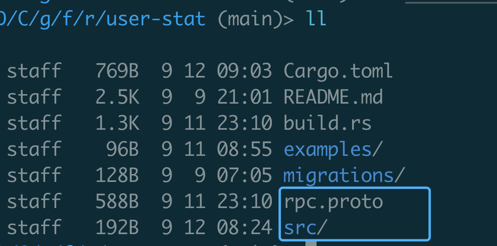
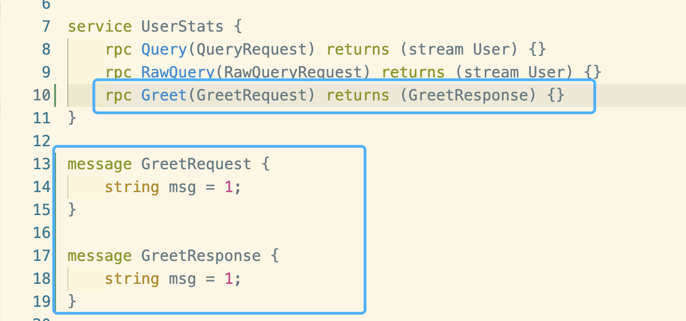
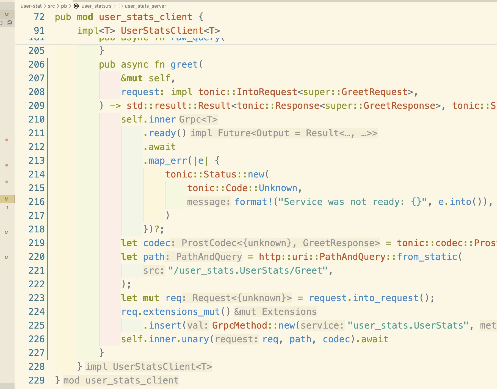
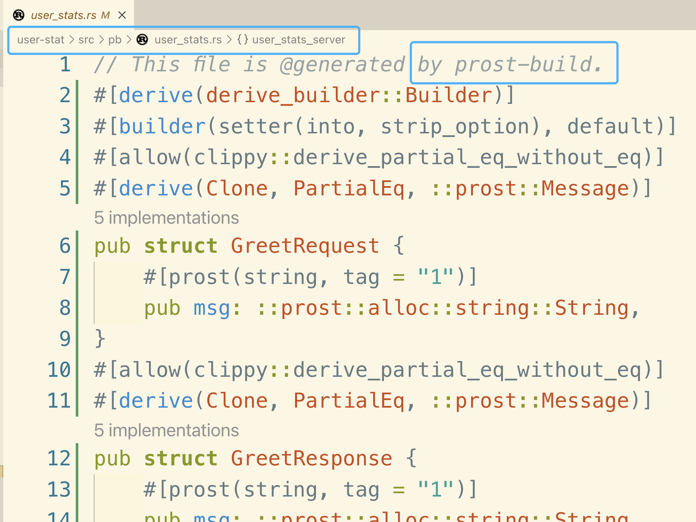

## Dependency

```toml
[dependencies]
anyhow = "1.0.82"
prost = "0.12.4"
prost-types = "0.12.4"
tonic = { version = "0.11.0", features = ["zstd", "tls"] }


[build-dependencies]
anyhow = "1.0.82"
tonic-build = "0.11.0"
```

## Generate PB

* put the proto under the project `src` directory


```proto
syntax = "proto3";

package user_stats;

import "google/protobuf/timestamp.proto";

service UserStats {
    rpc Query(QueryRequest) returns (stream User) {}
    rpc RawQuery(RawQueryRequest) returns (stream User) {}
}


message User {
    string email = 1;
    string name = 2;
}

message QueryRequest {
    map<string, TimeQuery> timestamps = 1;
    map<string, IDQuery> ids = 2;
}

message RawQueryRequest {
    string query = 1;
}

message TimeQuery {
    google.protobuf.Timestamp lower = 1;
    google.protobuf.Timestamp upper = 2;
}

message IDQuery {
    repeated uint32 ids = 1;
}
```

* use build.rs to generate protobuf.

```sh
user-stat (main)> cargo build
```

put build.rs under the project root.

```rust
use anyhow::Result;
use std::fs;

fn main() -> Result<()> {
    fs::create_dir_all("src/pb")?;
    let builder = tonic_build::configure();
    builder
        .out_dir("src/pb")
        .with_serde(
            &["User"],
            true,
            true,
            Some(&[r#"#[serde(rename_all = "camelCase")]"#]),
        )
        .compile(&["rpc.proto"], &["."])
        .unwrap();
    Ok(())
}

```




* the protobuf will be generated under `src/pb`

