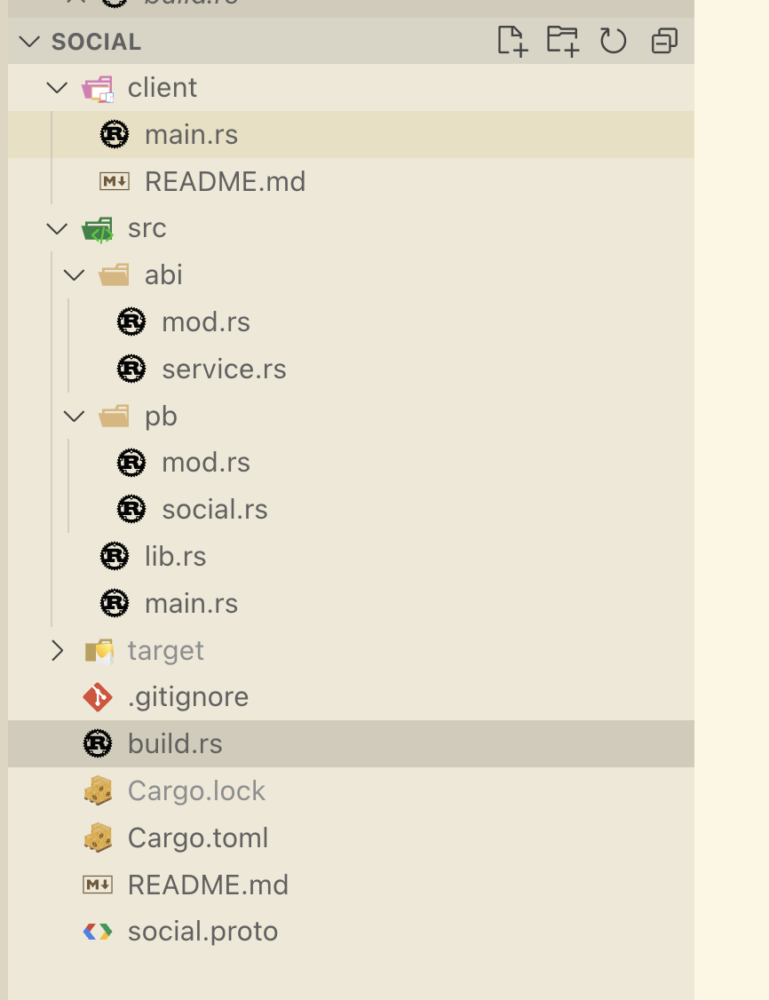

Let's build a Simple RPC Service with Tonic: `Social`, and it's only have greet endpoint to welcome the user.

## The Project Structure



## The Denependencies

```toml
[package]
name = "social"
version = "0.1.0"
edition = "2021"

[dependencies]
anyhow = "1.0.82"
chrono = { version = "0.4.38", features = ["serde"] }
derive_builder = "0.20.0"
futures = "0.3.30"
prost = "0.12.4"
prost-types = "0.12.4"
tokio = { version = "1.40.0", features = ["rt", "rt-multi-thread", "macros"] }
tokio-stream = "0.1.15"
tonic = { version = "0.11.0", features = ["zstd", "tls"] }
tonic-build = "0.11.0"

[build-dependencies]
anyhow = "1.0.82"
tonic-build = "0.11.0"

```

## The Protobuf

in the proto, we define a `SocialService` and it have only one method `Greet`.

path: `social-rs/social.proto`

```protobuf
syntax = "proto3";

package social;

// import "google/protobuf/timestamp.proto";

service SocialService {
    rpc Greet(GreetRequest) returns (GreetResponse) {}
}

message GreetRequest {
    string msg = 1;
}

message GreetResponse {
    string msg = 1;
}
```

## The build script

and we also need a build script to generate the protobuf client and servre code under `social-rs/src/pb` directory

```rust
use std::fs;

fn main() -> anyhow::Result<()> {
    fs::create_dir_all("src/pb")?;
    let builder = tonic_build::configure();
    builder
        .out_dir("src/pb")
        .compile(&["social.proto"], &["."])
        .unwrap();
    Ok(())
}
```

## Implement the Service

after generate the protobuf, now let's put the service implementation under the `src/abi/service.rs`

```sh
src (main)> tree abi
abi
├── mod.rs
└── service.rs
```

path: `src/pb/service.rs`

```rust
use tonic::{async_trait, Request, Response, Status};

use crate::pb::social::{
    social_service_server::{SocialService, SocialServiceServer},
    GreetRequest, GreetResponse,
};


pub struct SocialServiceImpl {
    inner: Arc<SocialServiceInner>,
}

#[async_trait]
impl SocialService for SocialServiceImpl {
    async fn greet(
        &self,
        request: Request<GreetRequest>,
    ) -> Result<Response<GreetResponse>, Status> {
        println!("get request: {:?}", request);

        let req = request.into_inner();

        let resp = format!("Hello {}, Welcome!", req.msg);
        Ok(Response::new(GreetResponse { msg: resp }))
    }
}
```

In the above code, we implemented the `SocialService` from pb. and for greet, we just return formated message with `format!("Hello {}, Welcome!", req.msg);`

`SocialService` is a trait, and it has one method `greet`.

```rust
pub trait SocialService: Send + Sync + 'static {
        async fn greet(
            &self,
            request: tonic::Request<super::GreetRequest>,
        ) -> std::result::Result<tonic::Response<super::GreetResponse>, tonic::Status>;
}
```

## The Server

after the implement the SocialService, let's see how to integrate it into the main.

* First, export the service mod in `abi/mod.rs`

```rust
pub mod service;
```

* And then export the `abi` module in the `lib.rs`

path: `src/lib.rs`

```rust
pub mod abi;
pub mod pb;
```

* impl the `SocialServiceImpl`

Initialize the `SocialServiceImpl` and then convert it into `SocialServiceServer`

path: `src/abi/service.rs`

```rust
use crate::pb::social::{
    social_service_server::{SocialService, SocialServiceServer},
    GreetRequest, GreetResponse,
};

impl SocialServiceImpl {
    pub fn new() -> Self {
        Self {
            inner: Arc::new(SocialServiceInner {}),
        }
    }

    pub fn into_server(self) -> SocialServiceServer<Self> {
        SocialServiceServer::new(self)
    }
}
```

* main function

```rust
use std::net::SocketAddr;

use social::abi::service::SocialServiceImpl;
use tonic::transport::Server;

#[tokio::main]
async fn main() -> anyhow::Result<()> {
    println!("starting social service server");

    let addr: SocketAddr = "[::1]:9090".parse().unwrap();

    println!("init social service server...");
    let service = SocialServiceImpl::new().into_server();

    println!("serve social service at {}", addr);
    Server::builder().add_service(service).serve(addr).await?;
    Ok(())
}
```

## Run Server

```sh
social (main) [SIGINT]> cargo run --bin social
   Compiling social v0.1.0 
starting social service server
init social service server...
serve social service at [::1]:9090
get request: Request { metadata: MetadataMap { headers: {"te": "trailers", "content-type": "application/grpc", "user-agent": "tonic/0.11.0"} }, message: GreetRequest { msg: "John" }, extensions: Extensions }
```
