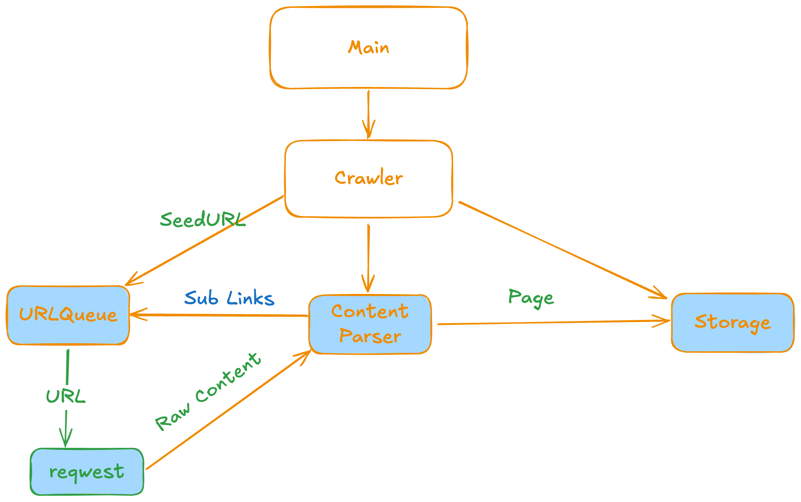
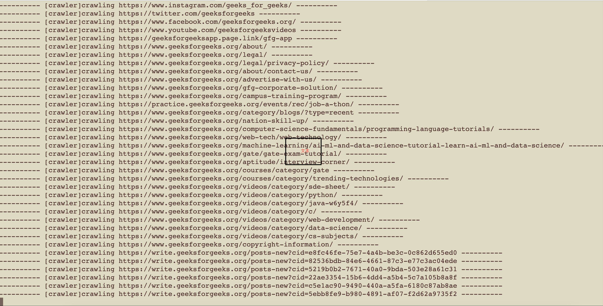

In this blog post, I will share how to build a tiny web crawler with Rust and Tokio(Async Runtime).

<!-- truncate -->

## What is a Web Crawler

A web crawler, also known as a spider, spiderbot, or search engine bot, is an automated software program or script that systematically browses the World Wide Web to discover, fetch, and index web pages and their content. These bots are primarily used by search engines like Google to build indexes for search results, but they also power other applications such as data mining, monitoring, and content aggregation. Essentially, crawlers act like digital explorers that "crawl" across the internet, following links to map out the web's structure.

## How it works

Web crawlers operate through a repetitive, automated process that mimics human browsing but at a massive scale. Here's a step-by-step breakdown of the typical workflow:

1. **Starting Point (Seed URLs)**: The crawler begins with a predefined list of starting URLs, called "seeds." These could be popular sites like homepages of major websites. This initial list kickstarts the exploration.

2. **Fetching Content**: For each URL in the queue, the crawler sends an HTTP request to download the page's HTML content, images, and other resources. It parses the HTML to understand the page's structure.

3. **Extracting Links**: The crawler scans the fetched page for hyperlinks (e.g., `<a href>` tags) and adds any new, unvisited URLs to its queue. This is often done using regular expressions or HTML parsers to identify valid links.

4. **Indexing and Processing**: As it fetches content, the crawler extracts and stores key information like text, metadata (e.g., titles, keywords), and sometimes media. For search engines, this data is indexed into a database for quick retrieval. It may also categorize pages based on topics or relevance.

5. **Recursion and Politeness**: The process repeats recursively: the crawler dequeues the next URL, fetches it, and continues. To avoid overwhelming servers, it respects rules like `robots.txt` files (which tell bots what to crawl or avoid), implements delays between requests, and limits the depth or frequency of visits.

6. **Handling Scale and Challenges**: Modern crawlers use distributed systems (e.g., multiple machines) to handle billions of pages. They filter out duplicates, handle redirects, and prioritize URLs based on factors like freshness or importance. Challenges include dealing with dynamic content (e.g., JavaScript-rendered pages) and avoiding spam or malicious sites.


## The Architecture of our tiny web crawler

So according what is a web crawler and how it works, our web crawler will be cons--- by 4 components:

* URL Queue: handles the URLs, let crawler to adding new URL into it, pop the URL that need to crawl.

* Crawler: the core component that contains the whole crawl logic, call other component to finish the crawl process.

* Content Parser: will parse the raw web content into the customized data structure(title, links, etc).  

* Storage: the storage component will save the crawled content from crawler engine.




## Code

### Init Project

```sh
cargo new --bin tiny-crawler1
```

### Dependency

* reqwest: for http request.
* tokio: for sending concurrent crawl task.
* scraper: parse html into custom data structure.
* futures: providing the foundations for asynchronous programming in Rust.
* url: URL validation.

```toml
[package]
name = "tiny-crawler1"
version = "0.1.0"
edition = "2024"

[dependencies]
reqwest = { version = "0.12", features = ["json"] }
tokio = { version = "1", features = ["full"] }
thiserror = "2.0.16"
scraper = "0.24.0"
futures = "0.3.31"
url = "2.5.7"
```

### URL Queue

`src/url_queue.rs`

```rust
use std::collections::HashSet;
use tokio::sync::{Mutex, mpsc};

use crate::errors::Errors;

#[derive(Debug, Clone)]
pub struct Link {
    pub url: String,
    pub base: String,
    pub depth: usize,
}

#[derive(Debug)]
pub struct URLQueue {
    // for sending links to be crawled
    sender: mpsc::Sender<Link>,
    // for receiving links to be crawled
    receiver: Mutex<mpsc::Receiver<Link>>,
    // to keep track of visited URLs
    visited: Mutex<HashSet<String>>,
}

impl URLQueue {
    pub fn new(queue_size: usize) -> Self {
        let (sender, receiver) = mpsc::channel(queue_size);

        Self {
            sender: sender,
            receiver: Mutex::new(receiver),
            visited: Mutex::new(HashSet::with_capacity(queue_size)),
        }
    }

    /*
    1. check if the URL has been visited
    2. if not, add it to the visited set and send it to the queue
    3. return true if added, false if already visited
    */
    pub async fn add_url(&self, link: &Link) -> Result<bool, Errors> {
        let mut visited = self.visited.lock().await;
        if visited.contains(&link.url) {
            return Ok(false);
        }

        visited.insert(link.url.clone());
        drop(visited);

        self.sender.send(link.clone()).await?;
        Ok(true)
    }

    // get the next link from the queue
    pub async fn get_next_link(&self) -> Option<Link> {
        let mut receiver = self.receiver.lock().await;
        receiver.recv().await
    }
}
```

### Parser

`src/parser.rs`

```rust
use crate::{errors::Errors, is_valid_url, storage::Page};
use scraper::{Html, Selector};

#[derive(Debug)]
pub struct ContentParser {
    pub title_seclector: Selector,
    pub link_selector: Selector,
}

#[derive(Debug)]
pub struct ParsedContent {
    pub links: Vec<String>,
    pub title: String,
}

impl ContentParser {
    pub fn new() -> Self {
        Self {
            title_seclector: Selector::parse("title").unwrap(),
            link_selector: Selector::parse("a[href]").unwrap(),
        }
    }

    pub fn parse(&self, content: &str, _: &str, depth: usize) -> Result<Page, Errors> {
        let doc = Html::parse_document(&content);

        let title = doc
            .select(&self.title_seclector)
            .next()
            .map(|el| el.text().collect::<String>())
            .unwrap_or_default();

        let links = doc
            .select(&self.link_selector)
            .filter_map(|el| el.value().attr("href").filter(|url| is_valid_url(url)))
            .map(|v| v.to_string())
            .collect();

        Ok(Page {
            title: title,
            content: content.to_string(),
            links,
            depth,
        })
    }
}
```

### Storage

`src/storage.rs`

```rust
use std::fs::File;
use std::io::Write;
use std::path::Path;

use crate::errors::Errors;

#[derive(Debug, Clone)]
pub struct Page {
    pub title: String,
    pub content: String,
    pub links: Vec<String>,
    pub depth: usize,
}

impl Page {
    pub fn new(title: String, content: String, links: Vec<String>, depth: usize) -> Self {
        Self {
            title,
            content,
            links,
            depth,
        }
    }
}

#[derive(Debug, Clone)]
pub struct DataStore {
    pub store_dir: String,
}

impl DataStore {
    pub fn new(dir: String) -> Result<Self, Errors> {
        let path = Path::new(&dir);
        std::fs::create_dir_all(path)?;
        Ok(Self { store_dir: dir })
    }

    pub fn save_page(&self, page: &Page) -> Result<(), Errors> {
        // Create the full file path
        let full_path = Path::new(&self.store_dir).join(page.title.clone());

        // Create or open the file
        let mut file = File::create(full_path)?;

        // Write content to file
        file.write_all(page.content.as_bytes())?;

        Ok(())
    }
}

```

### Errors

`src/errors.rs`

```rust
use thiserror::Error;
use tokio::sync::mpsc;

use crate::url_queue::Link;

#[derive(Error, Debug)]
pub enum Errors {
    #[error("craw data failed")]
    CrawDataError(#[from] reqwest::Error),
    #[error("crawl depth: {0} exceed max_depth: {1}")]
    InvalidDepth(usize, usize),
    #[error("create file failed")]
    SaveDataFailed(#[from] std::io::Error),

    #[error("send url failed")]
    SendURL2QueueFailed(#[from] mpsc::error::SendError<Link>),
}

```

### Crawler

`src/crawler.rs`

```rust
use crate::errors::Errors;
use crate::is_valid_url;
use crate::parser::ContentParser;
use crate::storage::{DataStore, Page};
use crate::url_queue::{Link, URLQueue};

use futures::future::join_all;
use reqwest::Client;
use std::sync::Arc;
use std::time::Duration;
use tokio::signal;
use tokio::sync::broadcast;
use tokio::task;
use tokio::time::sleep;

#[derive(Debug)]
pub struct Seed {
    pub url: String,
    pub base: String,
}

#[derive(Debug)]
pub struct Crawler {
    seed_urls: Vec<Seed>,
    max_depth: usize,
    max_worker: usize,
    parser: Arc<ContentParser>,
    page_store: Arc<DataStore>,
    url_queue: Arc<URLQueue>,
}

impl Crawler {
    pub fn new(
        seed_urls: Vec<Seed>,
        max_depth: usize,
        max_worker: usize,
        store_dir: String,
    ) -> Result<Self, Errors> {
        let store = DataStore::new(store_dir)?;

        Ok(Self {
            seed_urls,
            max_depth,
            max_worker,
            parser: Arc::new(ContentParser::new()),
            page_store: Arc::new(store),
            url_queue: Arc::new(URLQueue::new(100 as usize)),
        })
    }

    /*
    1. enqueue seed URLs
    2. spawn worker tasks
    3. each worker task:
        a. get next URL from queue
        b. retrieve page
        c. parse page
        d. save page
        e. enqueue new links
    4. handle shutdown signal (Ctrl+C)
    5. wait for all workers to finish
    6. return Ok(())
    */
    pub async fn crawl(&self) -> Result<(), Errors> {
        for seed in &self.seed_urls {
            let link = Link {
                url: seed.url.clone(),
                base: seed.base.clone(),
                depth: 1,
            };
            let _ = self.url_queue.add_url(&link).await?;
        }

        let (tx, _) = broadcast::channel::<()>(100);

        let mut workers = Vec::new();

        let max_depth = self.max_depth;

        for _ in 0..self.max_worker {
            let url_queue = Arc::clone(&self.url_queue);
            let page_store = Arc::clone(&self.page_store);
            let content_parser = Arc::clone(&self.parser);
            let tx_clone = tx.clone();
            
            let crawl_task = task::spawn(async move {
                let mut recv_stop = tx_clone.subscribe();

                'crawl_task: loop {
                    tokio::select! {
                        _ = recv_stop.recv() => {
                            println!("received stop signal, stop crawl task");
                            break 'crawl_task;
                        },
                        _ = sleep(Duration::from_millis(50)) => {
                            match url_queue.get_next_link().await {
                                Some(target) => {
                                    println!(
                                        "{} [crawler]crawling {} {}",
                                        "-".repeat(10),
                                        target.url,
                                        "-".repeat(10)
                                    );

                                    if target.depth > max_depth {
                                        continue 'crawl_task;
                                    }

                                    if let Err(e) =
                                        process_crawl(&content_parser, &target, &page_store, &url_queue).await
                                    {
                                        eprintln!("failed to crawl: {:?}, {}", target, e);
                                    }
                                }

                                None => {
                                    // queue is empty, wait for a while
                                    sleep(Duration::from_millis(100)).await;
                                    continue;
                                }
                            }
                        }
                    }
                }
            });

            workers.push(crawl_task);
        }

        match signal::ctrl_c().await {
            Ok(()) => {
                println!("Main task: Ctrl+C received, sending shutdown signal...");
                let _ = tx.send(()); // Send shutdown signal to all sub-tasks
            }
            Err(e) => {
                eprintln!("Main task: Error receiving Ctrl+C: {}", e);
            }
        }

        for (i, worker) in join_all(workers).await.into_iter().enumerate() {
            if let Err(e) = worker {
                eprintln!("Worker {} ended with error: {}", i, e);
            }
        }

        Ok(())
    }
}

/*
1. retrieve page with reqwest
2. parse page with content_parser
3. save page to DataStore
4. enqueue new links to URLQueue
*/
pub async fn process_crawl(
    content_parser: &ContentParser,
    target: &Link,
    page_store: &DataStore,
    url_queue: &URLQueue,
) -> Result<(), Errors> {
    let client = reqwest::Client::new();
    let res_page = retrieve_page(
        &client,
        &content_parser,
        &target.url,
        &target.base,
        target.depth,
    )
    .await?;

    if res_page.title.is_empty() {
        eprintln!("empty title for url: {}", target.url);
        return Ok(());
    }

    let _ = page_store.save_page(&res_page)?;
    for url in &res_page.links {
        if !is_valid_url(&url) {
            eprintln!("{} is not valid URL", url);
            continue;
        }

        let link = Link {
            url: url.clone(),
            base: target.base.clone(),
            depth: res_page.depth + 1,
        };

        println!("enqueue url: {:?} into URL Queue", link);
        if let Err(e) = url_queue.add_url(&link).await {
            eprintln!("failed to add link: {}, {:?}", url, e);
        }
    }

    Ok(())
}

pub async fn retrieve_page(
    client: &Client,
    parser: &ContentParser,
    url_str: &str,
    base_url: &str,
    depth: usize,
) -> Result<Page, Errors> {
    let res = client.get(url_str).send().await?;
    let resp_content = res.text().await?;
    let page = parser.parse(&resp_content, base_url, depth)?;

    Ok(page)
}
```

### Lib

`src/lib.rs`

```rust
pub mod crawler;
pub mod errors;
pub mod parser;
pub mod storage;
pub mod url_queue;

use url::Url;

pub fn is_valid_url(s: &str) -> bool {
    Url::parse(s).is_ok()
}
```

### Main

```rust
use tiny_crawler1::crawler::Seed;
use tiny_crawler1::{crawler, errors::Errors};

#[tokio::main]
async fn main() -> Result<(), Errors> {
    let mut seed_urls: Vec<Seed> = Vec::with_capacity(10);
    let url = "https://zh.wikipedia.org/wiki/%E5%B2%B3%E9%A3%9E".to_string();
    seed_urls.push(Seed {
        url: url.clone(),
        base: "https://zh.wikipedia.org".to_string(),
    });

    if let Ok(my_crawler) = crawler::Crawler::new(seed_urls, 1, 1, "./data".to_string()) {
        // 启动爬虫任务
        match my_crawler.crawl().await {
            Ok(_) => println!("Successfully crawled"),
            Err(e) => eprintln!("Failed to crawl: {}", e),
        }
    } else {
        eprintln!("Failed to create crawler");
    }

    Ok(())
}
```

### Crawling data



## Summary

In this project, we use URLQueue(`mpsc::channel`) to enqueue and deque URL, and use `reqwest` crate to send http request, use `tokio spawn` to dispatch the crawl tasks, and wait all tasks to be done with `join_all`, and finally write the data into File Storage.