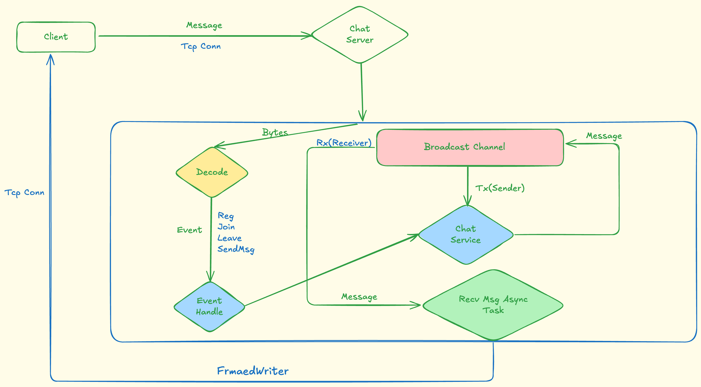

# Building a Real-Time Text Chat App in Rust with Tokio Broadcast and LinesCodec

## Introduction

Today, we're diving into building a lightweight, multi-client text chat server that leverages `Rust` and `Tokio` to deliver seamless, real-time messaging.

 So, to build real time text-based chat app, there are some issues that need to resolve:

* How to make the app real time: We use `TCP` to build the connection between client and server, and send message to client real time.
* How to Decode from the raw bytes from TCP connection, and Encode the Message and send through the TCP Connection?.
* How to build a multi-client server to accept clients conn.
* How to dispatch the Message from one user to other users(clients).
* How to Manage the users, channels, and messages.


## Prerequisites
So, to understand this project, you may need to know some Rust knowledge:

* how to use struct to build custom data structure.
* how to use std collection data type, like: `HashMap`, `Vec`, `hashSet`.
* how to safely share data between different `async task` with `Arc<RwLock<T>>`.

## Project Setup

- Initialize the project:

```sh
cargo new --bin txt-chat
```

- the project dir:

```sh
➜  txt-chat git:(main) ✗ tree -I target
.
├── Cargo.lock
├── Cargo.toml
├── README.md
├── examples
│   └── server.rs
├── server_log.png
└── src
    ├── chatsvc
    │   └── mod.rs
    ├── client
    │   └── client.rs
    ├── errors.rs
    ├── event
    │   ├── handler.rs
    │   └── mod.rs
    ├── lib.rs
    └── main.rs
```

- Dependencies:

```toml
[dependencies]
tokio = { version = "1.47.1", features = ["io-std", "io-util", "net", "sync", "rt-multi-thread", "signal", "macros"] }
bytes = "1"
tracing = "0.1.41"
tracing-subscriber = "0.3.20"
tokio-util = { version="0.7.16", features=["codec"] }
thiserror = "2.0.16"
chrono = "0.4.42"
nanoid = "0.4.0"
anyhow = "1.0.99"
futures = "0.3"
```

## Core Concepts
- Tokio Runtime: 

Tokio is A runtime for executing asynchronous Rust code. Since for our chat project, the multi-client will async connect to the server and the message dispatch will handled async.

* [Broadcast Channels](https://docs.rs/tokio/1.48.0/tokio/sync/broadcast/index.html):

In tokio, there is a channel type: **broadcast channel**:

> A multi-producer, multi-consumer broadcast queue. Each sent value is seen by all consumers.
> A Sender is used to broadcast values to all connected Receiver values. Sender handles are clone-able, allowing concurrent send and receive actions. Sender and Receiver are both Send and Sync as long as T is Send.

> When a value is sent, all Receiver handles are notified and will receive the value.

which is very suit for our chat app, since we will use this brocast chaneel to dispatch the message between multiple clients.

- [LinesCodec](https://docs.rs/tokio-util/latest/tokio_util/codec/struct.LinesCodec.html): Demystify line-based encoding/decoding for TCP streams, including framing errors and buffering.

## The data flow

before we dive in implementation of the chat server, let first check how the data(message) was flowed in the chat service.



## Implementing the Chat Server
- Step 1: Setting up the Tokio runtime and TCP listener.
  - Bind to a port (e.g., 8080) and accept incoming connections asynchronously.

```rust
use std::sync::Arc;

use anyhow::anyhow;
use futures::{SinkExt, StreamExt};
use tokio::io::{self, WriteHalf};
use tokio::net::{TcpListener, TcpStream};
use tokio::sync::{RwLock, broadcast};
use tokio_util::codec::{FramedRead, FramedWrite, LinesCodec};
use tracing::{info, level_filters::LevelFilter, warn};
use tracing_subscriber::{Layer as _, fmt::Layer, layer::SubscriberExt, util::SubscriberInitExt};
use txt_chat::chatsvc::Message;
use txt_chat::{
    chatsvc::ChatService,
    event::{Event, handler::handle_event},
};

#[tokio::main]
async fn main() -> anyhow::Result<()> {
    let layer = Layer::new().with_filter(LevelFilter::INFO);
    tracing_subscriber::registry().with(layer).init();

    let addr = "0.0.0.0:9090";
    let listener = TcpListener::bind(&addr)
        .await
        .map_err(|e| anyhow!("Faile to listen on {}: {}", addr, e))?;

    info!("server listen on: {}", addr);
}
```

- Step 2: Handling client connections.
  - Spawn a task per client for reading/writing to the socket.
  - Use `Framed` with LinesCodec to decode incoming lines into strings.  
  

`src/main.rs`

```rust
#[tokio::main]
async fn main() -> anyhow::Result<()> {
    // ...

    let (tx, _) = broadcast::channel::<Message>(1000);
    let tx1 = tx.clone();
    let chat_sevice = Arc::new(RwLock::new(ChatService::new(1000, tx)));

    loop {
        match listener.accept().await {
            Ok((socket, client_addr)) => {
                info!("accept conn from: {}", client_addr.clone());

                let uid = format!("{:?}", client_addr);
                let tx_clone = tx1.clone();
                let svc = chat_sevice.clone();
                tokio::spawn(async move {
                    serve_conn(socket, uid, tx_clone, &svc).await;
                });
            }
            Err(e) => warn!("Faield to accept conn: {}", e),
        }
    }
}
```

- Create a global broadcast sender in the main task.
- On receiving a message from a client, send it via the broadcast channel.

```rust
async fn serve_conn(
    socket: TcpStream,
    uid: String,
    tx: Sender<Message>,
    chat_sevice: &Arc<RwLock<ChatService>>,
) {
    // Split the socket into read and write halves
    let (reader, writer) = io::split(socket);

    let mut framed_read = FramedRead::new(reader, LinesCodec::new());
    let mut framed_write = FramedWrite::new(writer, LinesCodec::new());

    let user_id1 = uid.clone();
    let mut rx = tx.subscribe();

    let svc1 = chat_sevice.clone();
    let svc2 = chat_sevice.clone();

    tokio::spawn(async move {
        info!("recv msg for user: {}", user_id1);
        recv_msg(svc1, user_id1, &mut rx, &mut framed_write).await;
    });

    loop {
        match framed_read.next().await {
            Some(frame_res) => match frame_res {
                Ok(message) => {
                    info!("read message from client: {:?}", message);

                    let event = Event::from_string(message);
                    match event {
                        Ok(ev) => {
                            info!("handle event: {:?}", ev);
                            handle_event(uid.clone(), svc2.clone(), ev).await;
                        }
                        Err(e) => {
                            warn!("error: {}", e);
                        }
                    }
                }
                Err(e) => {
                    warn!("fail read frame: {:?}", e);
                    break;
                }
            },
            None => {
                warn!("No frame");
                break;
            }
        }
    }
}
```

- Step 3: Broadcasting to clients.
  - Each client subscribes to the broadcast receiver.
  - Handle incoming broadcasts by encoding lines and writing back to the socket.

```rust
async fn recv_msg(
    svc: Arc<RwLock<ChatService>>,
    uid: String,
    rx: &mut broadcast::Receiver<Message>,
    framed_write: &mut FramedWrite<WriteHalf<TcpStream>, LinesCodec>,
) {
    while let Ok(msg) = rx.recv().await {
        let svc = svc.read().await;
        if !svc.is_user_sub(&uid, &msg.chan_id) {
            drop(svc);
            continue;
        }
        drop(svc);

        let _ = framed_write
            .send(msg.to_string())
            .await
            .map_err(|e| anyhow!("Failed to send response: {}", e));
    }
}
```

## Implementing the Event and Event Handle

In the event mod, we define different messages that client can send to chat server.

and implemented how to parse event from a line of string.

- `src/event/mod.rs`
```rust
use crate::errors::ChatErrors;

pub mod handler;


#[derive(Debug, Clone)]
pub enum Event {
    Register{username: String}, // reg${{username}}
    CreateChan{user_id: String, chan_name: String}, // create_chan$123$MyChat
    JoinChan{user_id: String, chan_id: String}, // join$123$456
    LeaveChan{user_id: String, chan_id: String}, // leave$123$456
    SendMsg{user_id: String, chan_id: String, msg: String}, // send_msg$123$456$Hello
    Unknown,
}

impl Event {
    pub fn from_string(line: String) -> Result<Self, ChatErrors> {
        let parts: Vec<&str> = line.split("$").into_iter().collect();
        match parts[0] {
            "reg" => {
                if parts.len() < 2 {
                    return Err(ChatErrors::InvalidCommand("reg need username".to_string()));
                }
                Ok(Self::Register { username: parts[1].to_string()})
            }

            "create_chan" => {
                if parts.len() < 3 {
                    return Err(ChatErrors::InvalidCommand("create channel need user id and chan name".to_string()));
                }
                Ok(Self::CreateChan { user_id: parts[1].to_string(), chan_name: parts[2].to_string() })
            }

            "join" => {
                if parts.len() < 3 {
                    return Err(ChatErrors::InvalidCommand("join need user id and chan id".to_string()));
                }
                Ok(Self::JoinChan { user_id: parts[1].to_string(), chan_id: parts[2].to_string() })
            }

            "leave" => {
                if parts.len() < 3 {
                    return Err(ChatErrors::InvalidCommand("leave need user id and chan id".to_string()));
                }
                Ok(Self::LeaveChan { user_id: parts[1].to_string(), chan_id: parts[2].to_string() })
            }

            "send_msg" => {
                if parts.len() < 4 {
                    return Err(ChatErrors::InvalidCommand("send_msg need user id and chan id and msg content".to_string()));
                }
                Ok(Self::SendMsg { user_id: parts[1].to_string(), chan_id: parts[2].to_string() , msg: parts[3].to_string() })
            }
            _ => Err(ChatErrors::CommandNotSupport(parts[0].to_string()))
        }
    }
}

```

In the event handler, we dispatch the event to related Service method to finish the 

- `src/event/handler.rs`

```rust
use std::sync::Arc;

use tokio::sync::RwLock;
use tracing::info;

use crate::{chatsvc::ChatService, event::Event};

pub async fn handle_event(uid: String, svc: Arc<RwLock<ChatService>>, event: Event) {
    info!("start handle event");
    let mut svc = svc.write().await;
    info!("lock service...");

    match event {
        Event::Register { username } => {
            info!("adding user to service");
            svc.add_user(username, uid);
        }
        Event::CreateChan { user_id, chan_name } => {svc.create_chan(user_id, chan_name, None);},
        Event::JoinChan { user_id, chan_id } => svc.join_chan(user_id, chan_id),
        Event::LeaveChan { user_id, chan_id } => svc.leave_chan(user_id, chan_id),
        Event::SendMsg {
            user_id,
            chan_id,
            msg,
        } => svc.send_msg(user_id, chan_id, msg),
        Event::Unknown => {},
    }
}

```


## implement the Chat Service

`src/chatsvc/mod.rs`

chat serice is the core data structure that used to manange the user-channel relation.

```rust
use nanoid::nanoid;
use std::collections::{HashMap, HashSet};
use tracing::{info, warn};

use chrono::Utc;
use tokio::sync::broadcast;

const JOIN_RESP: &'static str = "$$joined";

#[derive(Debug, Clone)]
pub struct UserInfo {
    pub id: String,
    pub name: String,
}

#[derive(Debug, Clone)]
pub struct Message {
    pub chan_id: String,
    pub sender: String,
    pub content: String,
    pub send_time: chrono::DateTime<Utc>,
}

#[derive(Debug)]
pub struct Channel {
    pub id: String,
    pub name: String,
    pub online_users: HashMap<String, ()>,
}

pub struct ChatService {
    pub tx: broadcast::Sender<Message>,
    pub users: HashMap<String, UserInfo>,
    pub channels: HashMap<String, Channel>,
    pub user_chans: HashMap<String, HashSet<String>>,
}
```

### Register User

- user added to the users `HashMap` with uid as the key, userInfo(uid, name) as the value.
- automaticly create a channel with `id=user_id`.
- send the channel_id to the broadcast channel.

```rust
impl ChatService {
    // ...
    pub fn add_user(&mut self, name: String, uid: String) {
        let user = UserInfo {
            id: uid.clone(),
            name: name.clone(),
        };

        info!("create user: {:?}", user);

        self.users.insert(uid.clone(), user.clone());
        let chan_id = self.create_chan(uid.clone(), name.clone(), Some(uid.clone()));
        info!("user: {} created chan: {}", uid.clone(), chan_id.clone());

        self.send_msg(name, chan_id.clone(), chan_id);
    }
    // ...
}
```

### Create Channel

- Create a channel with the name.
- Append the channel into the `channels` `HashMap`.
- insert the `channel_id` into the `user_chans` data to know what chans user joined.
- send back the `chan_id` to user with broadcast channel.

```rust
pub fn create_chan(
        &mut self,
        uid: String,
        name: String,
        pre_chan_id: Option<String>,
    ) -> String {
        let mut chan = Channel::new(name);
        let mut not_send = false;
        if pre_chan_id.is_some() {
            not_send = true;
            chan.id = pre_chan_id.unwrap();
        }

        let chan_id = chan.id.clone();
        self.channels.insert(chan_id.clone(), chan);

        let mut set = HashSet::new();
        set.insert(chan_id.clone());

        self.user_chans
            .entry(uid.clone())
            .and_modify(|chans| {
                chans.insert(chan_id.clone());
            })
            .or_insert(set);

        if not_send {
            return chan_id;
        }

        if let Some(user) = self.users.get(&uid) {
            self.send_msg(user.name.clone(), chan_id.clone(), chan_id.clone());
        }

        chan_id
    }
```

### Join Channel

- get channel with `chan_id` from user event.
- insert the channel_id into the `user_chans`.
- send the joined `chan_id` back to tokio broadcast channel.

```rust
pub fn join_chan(&mut self, uid: String, chan_id: String) {
        match self.channels.get_mut(&chan_id) {
            Some(chan) => {
                chan.join(uid.clone());

                let mut set = HashSet::new();
                set.insert(chan_id.clone());

                self.user_chans
                    .entry(uid.clone())
                    .and_modify(|chans| {
                        chans.insert(chan_id.clone());
                    })
                    .or_insert(set);

                if let Some(user) = self.users.get(&uid) {
                    self.send_msg(
                        user.name.clone(),
                        chan_id.clone(),
                        format!("{}: {}", JOIN_RESP, chan_id),
                    );
                }
            }
            None => info!("chan {} not found", chan_id),
        }
    }
```

### leave channel

- get channel with `chan_id` from user event.
- remove the channel_id from the `user_chans`.
- send the joined `chan_id` back to tokio broadcast channel.

```rust
pub fn leave_chan(&mut self, uid: String, chan_id: String) {
        match self.channels.get_mut(&chan_id) {
            Some(chan) => {
                chan.leave(uid.clone());

                match self.user_chans.get_mut(&uid) {
                    Some(chans) => {
                        chans.remove(&chan_id);
                    }
                    None => {}
                }
            }
            None => info!("chan {} not found", chan_id),
        }
    }
```

### Send Message

- send the `Message` to the tokio broadcast channel, and the recv_msg task will consume the message in the `main`

```rust
    pub fn send_msg(&self, username: String, chan_id: String, msg: String) {
        match self.channels.get(&chan_id) {
            Some(_) => {
                match self
                    .tx
                    .send(Message::new(username.clone(), chan_id.clone(), msg))
                {
                    Ok(v) => {
                        info!("success send {} message", v);
                    }
                    Err(e) => warn!("failed to send msg to channel: {}, {}", chan_id, e),
                }
                info!("user: {} send msg to: {}", username, chan_id);
            }
            None => {
                info!("chan {} not found", chan_id);
            }
        }
    }
```

## Building a Simple Client

The client for a real-time text chat app using Tokio for async I/O. It connects to a TCP server, registers a user, handles stdin input (messages or commands), and processes server responses. Core flow: setup → register → input loop (send) → response loop (receive) → cleanup.


```rust
#[tokio::main]
async fn main() -> Result<()> {
    let layer = Layer::new().with_filter(LevelFilter::INFO);
    tracing_subscriber::registry().with(layer).init();

    // Connect to the server
    let stream = TcpStream::connect("0.0.0.0:9090").await?;
    info!("Connected to 0.0.0.0:9090");

    let user_id = format!("{:?}", stream.local_addr()?);

    // Split the stream into read and write halves
    let (read_half, write_half) = stream.into_split();

    // Create framed reader and writer with LinesCodec
    let mut framed_read = FramedRead::new(read_half, LinesCodec::new());
    let mut framed_write = FramedWrite::new(write_half, LinesCodec::new());

    let args: Vec<String> = env::args().collect();
    let user_name = &args[1];

    if let Some(Ok(welcome)) = framed_read.next().await {
        info!("{}", welcome);
    }

    match framed_write.send(encode_reg(user_name.to_string())).await {
        Ok(_) => {}
        Err(e) => {
            warn!("register user failed: {}", e);
            return Ok(());
        }
    }

    let state = Arc::new(RwLock::new(ClientState::new(user_id)));
    if let Some(Ok(cur_chan)) = framed_read.next().await {
        let mut state = state.write().await;
        state.current_chan = cur_chan
    } else {
        warn!("register user failed");
        return Ok(());
    }
    let state_clone = state.clone();
    let state_clone1 = state.clone();

    // Spawn a task to handle sending lines from stdin
    let send_task = tokio::spawn(async move {
        let stdin = BufReader::new(tokio::io::stdin());
        let mut lines = stdin.lines();

        loop {
            let line_res = lines.next_line().await;
            match line_res {
                Ok(Some(line)) => {
                    if line.trim().is_empty() {
                        continue;
                    }

                    let state = state_clone.read().await;
                    let (yes, chan_id) = match is_join(line.clone()) {
                        Ok((yes, chan_id)) => (yes, chan_id),
                        Err(e) => {
                            warn!("error: {}", e);
                            (false, "".to_string())
                        }
                    };

                    if yes {
                        let msg = encode_join(&state, chan_id);
                        if framed_write.send(msg).await.is_err() {
                            warn!("Failed to send line");
                            break;
                        }
                    } else {
                        if let Ok(msg) = encode_send_msg(&state, line) {
                            if framed_write.send(msg).await.is_err() {
                                warn!("Failed to send line");
                                break;
                            }
                        }
                    }
                }
                Ok(None) | Err(_) => break,
            }
        }

        // Gracefully shut down the write half
        if let Err(e) =
            <FramedWrite<OwnedWriteHalf, LinesCodec> as SinkExt<String>>::close(&mut framed_write)
                .await
        {
            warn!("Failed to close writer: {}", e);
        }
    });

    // Read lines from the server until EOF or error
    while let Some(line_result) = framed_read.next().await {
        match line_result {
            Ok(line) => {
                println!(">> {}", line);

                let mut state = state_clone1.write().await;
                if let Ok(joined_chan) = parse_join_resp(&line) {
                    state.switch_chan(joined_chan);
                }
            }
            Err(e) => {
                eprintln!("Error reading line: {}", e);
                break;
            }
        }
    }

    // Wait for the send task to complete
    if let Err(e) = send_task.await {
        eprintln!("Send task failed: {}", e);
    }

    println!("Connection closed.");
    Ok(())
}

fn is_join(line: String) -> Result<(bool, String), String> {
    if line.starts_with("$") {
        let parts: Vec<&str> = line.split(" ").collect();
        if parts[0] == JOIN {
            if parts.len() < 2 {
                return Err("join need chan_id".to_string());
            }

            return Ok((true, parts[1].to_string()));
        }
        Ok((false, "".to_string()))
    } else {
        Ok((false, "".to_string()))
    }
}

fn parse_join_resp(line: &String) -> Result<String, String> {
    let parts: Vec<&str> = line.split(": ").collect();
    if parts.len() < 2 {
        return Err("invalid join resp".to_string());
    }

    if line.starts_with("$$") && parts[0] == JOIN_RESP {
        return Ok(parts[1].to_string());
    }

    Err("not join resp".to_string())
}
```

#### Key Components
- **ClientState**: Mutable struct tracking user ID, personal channel, current channel, and joined channels (HashSet). Methods: set UID, add/remove/switch channels.
- **Encoding Functions**: Format commands as strings for server:
  - `encode_reg`: "reg$username"
  - `encode_join`: "join$uid$chan_id"
  - `encode_leave`: "leave$uid$chan_id" (unused here)
  - `encode_create_chan`: "create_chan$uid$chan_name" (unused)
  - `encode_send_msg`: "send_msg$uid$chan_id$message" (errors if no current chan)

#### Main Function Flow
1. **Setup**:
   - Init tracing logger (INFO level).
   - Connect TCP to "0.0.0.0:9090"; generate user_id from local addr.
   - Split stream into read/write halves; frame both with `LinesCodec` for line-based I/O.
   - Parse username from CLI args.

2. **Registration**:
   - Read welcome message from server; log it.
   - Send registration: `framed_write.send(encode_reg(username))`.
   - Read server response (assigned channel); update `ClientState` (Arc<RwLock> for shared access).
   - Clone state for tasks.

3. **Send Task (Spawned Async)**:
   - Read stdin lines via `BufReader`.
   - Loop:
     - Skip empty lines.
     - Check `is_join(line)`: If starts with "$join chan_id", encode as join command.
     - Else, encode as message via `encode_send_msg` (uses current chan).
     - Send via `framed_write`; break on error.
   - Close writer on exit.

4. **Receive Loop (Main Task)**:
   - While lines from `framed_read`:
     - Print received line.
     - Parse with `parse_join_resp`: If "$$joined: chan_id", switch current chan in state.
     - Break on error.

## Running and Testing the App

### Run Server

```sh
➜  txt-chat git:(main) ✗ cargo run --bin txt-chat
     Running `target/debug/txt-chat`
2025-10-15T08:07:50.249541Z  INFO txt_chat: server listen on: 0.0.0.0:9090
2025-10-15T08:08:46.695356Z  INFO txt_chat: accept conn from: 127.0.0.1:53974
2025-10-15T08:08:46.695633Z  INFO txt_chat: read message from client: "reg$alice"
2025-10-15T08:08:46.695679Z  INFO txt_chat: handle event: Register { username: "alice" }
2025-10-15T08:08:46.695693Z  INFO txt_chat::event::handler: start handle event
2025-10-15T08:08:46.695710Z  INFO txt_chat::event::handler: lock service...
2025-10-15T08:08:46.695719Z  INFO txt_chat::event::handler: adding user to service
2025-10-15T08:08:46.695728Z  INFO txt_chat::chatsvc: create user: UserInfo { id: "127.0.0.1:53974", name: "alice" }
2025-10-15T08:08:46.695901Z  INFO txt_chat::chatsvc: user: 127.0.0.1:53974 created chan: 127.0.0.1:53974
2025-10-15T08:08:46.695925Z  INFO txt_chat::chatsvc: success send 1 message
2025-10-15T08:08:46.695936Z  INFO txt_chat::chatsvc: user: alice send msg to: 127.0.0.1:53974
2025-10-15T08:08:46.695982Z  INFO txt_chat: recv msg for user: 127.0.0.1:53974
2025-10-15T08:09:14.221609Z  INFO txt_chat: accept conn from: 127.0.0.1:53984
2025-10-15T08:09:14.221833Z  INFO txt_chat: read message from client: "reg$Bob"
2025-10-15T08:09:14.221868Z  INFO txt_chat: handle event: Register { username: "Bob" }
2025-10-15T08:09:14.221882Z  INFO txt_chat::event::handler: start handle event
2025-10-15T08:09:14.221898Z  INFO txt_chat::event::handler: lock service...
2025-10-15T08:09:14.221907Z  INFO txt_chat::event::handler: adding user to service
2025-10-15T08:09:14.221915Z  INFO txt_chat::chatsvc: create user: UserInfo { id: "127.0.0.1:53984", name: "Bob" }
2025-10-15T08:09:14.222037Z  INFO txt_chat::chatsvc: user: 127.0.0.1:53984 created chan: 127.0.0.1:53984
2025-10-15T08:09:14.222067Z  INFO txt_chat::chatsvc: success send 2 message
2025-10-15T08:09:14.222076Z  INFO txt_chat::chatsvc: user: Bob send msg to: 127.0.0.1:53984
2025-10-15T08:09:14.222100Z  INFO txt_chat: recv msg for user: 127.0.0.1:53984
```

### Run Client

* first client

```sh
txt-chat git:(main) ✗ cargo run --bin txt-chat

2025-10-15T08:28:17.191198Z  INFO client: Connected to 0.0.0.0:9090
2025-10-15T08:28:17.191535Z  INFO client: ------Welcome to Txt Chat------
>> 127.0.0.1:54102
Hello
Alice
$join 127.0.0.1:54104
>> $$joined: 127.0.0.1:54104
2025-10-15T08:16:44.362032Z  INFO client: switched to channel: 127.0.0.1:54104
ni hao
>> ni hao
hello friend 
>> hello friend
>>  127.0.0.1:54104how do you do
so far so good
>> so far so good
>> nice!
```

* second client

```sh
2025-10-15T08:28:13.414724Z  INFO client: Connected to 0.0.0.0:9090
2025-10-15T08:28:13.415036Z  INFO client: ------Welcome to Txt Chat------

>> 127.0.0.1:54104
 127.0.0.1:54104>> $$joined: 127.0.0.1:54104
2025-10-15T08:16:44.362176Z  INFO client: switched to channel: 127.0.0.1:54104
>> ni hao
>> hello friend
how do you do
>>  127.0.0.1:54104how do you do
>> so far so good
nice! 
>> nice!
```

## Conclusion
- Recap: Key takeaways on leveraging Tokio's ecosystem for real-time apps.
- Call to action: Encourage readers to fork the code, experiment, and share their versions.
- Resources: Full code repo link (if providing), further reading on advanced Tokio features.