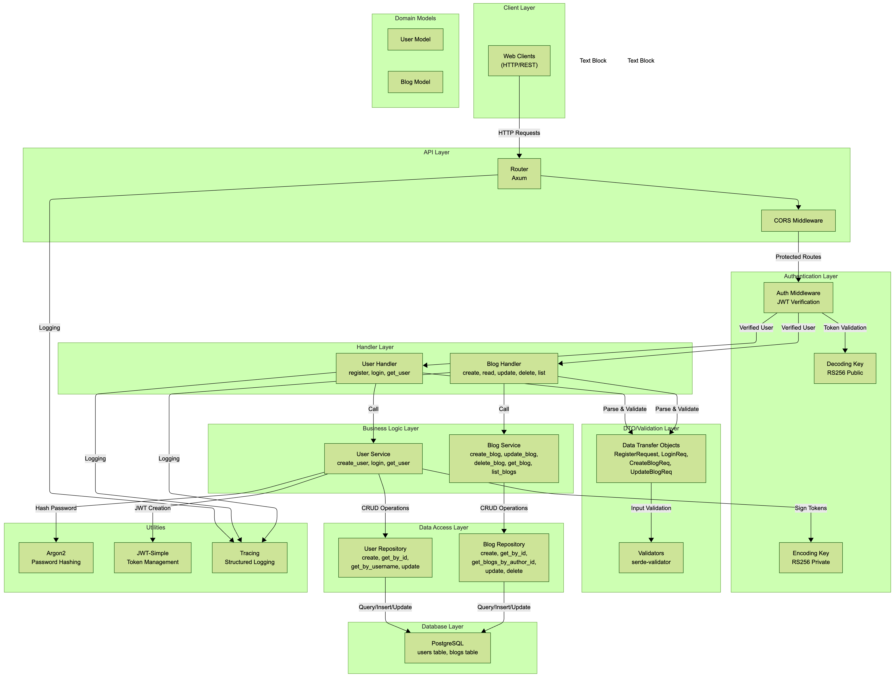
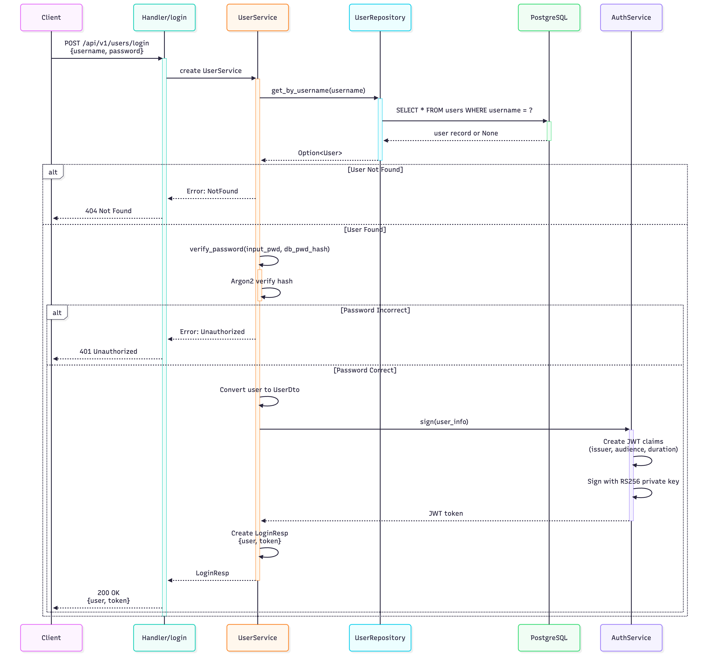
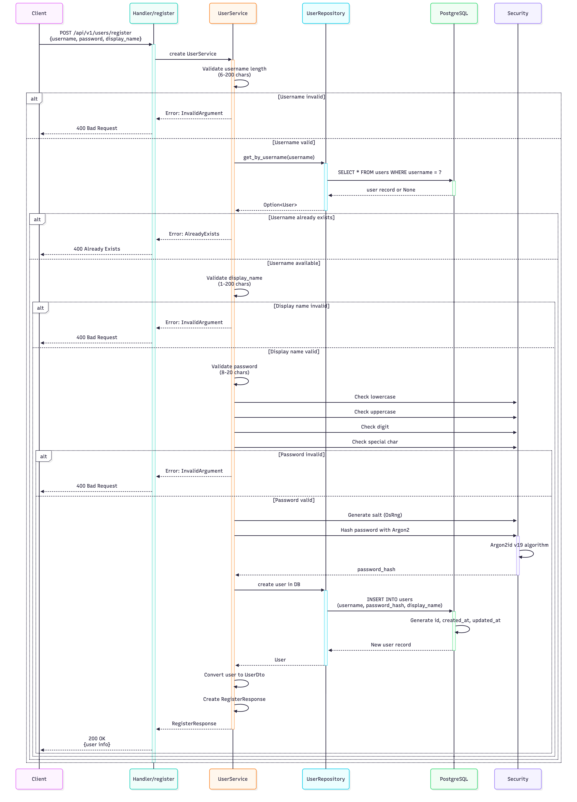
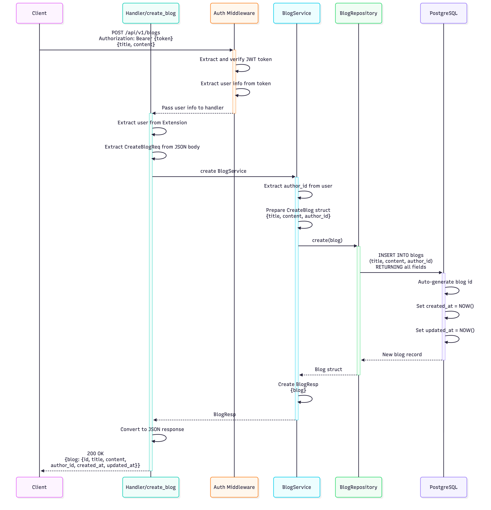
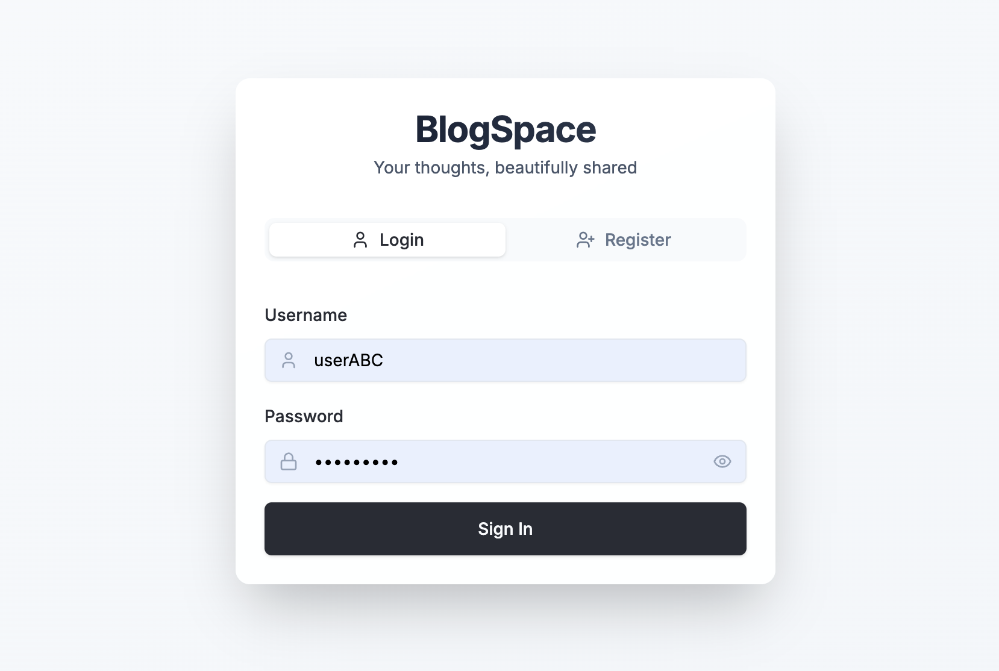
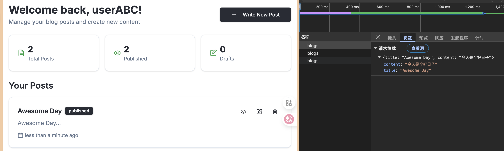
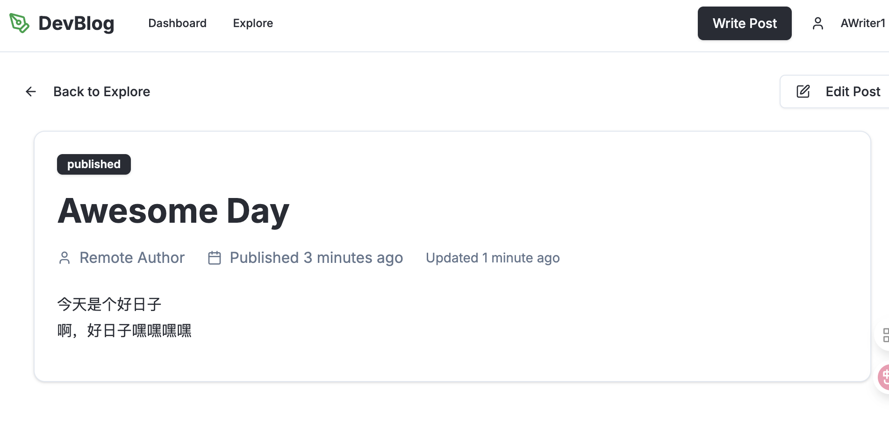

# Building a scalable REST API in Rust for blogging.

## What is mini-blog and why it was built

`mini-blog` is a simple blog platform, let user manage user's blog post with REST API.

Since I am learning Rust and Axum for web development, So I think the best way to learn is to build a real word app to help learn it.

and for this project, here is the basic techs it it used:

* Rust: we use rust programming to build this.
* Axum: the web framework we used to build this REST API
* PostgreSQL: The Databased used to store user's blog.
* JWT authentication: The way how we autenticate the users.

<!-- truncate -->

## High-Level Design

So in this project we use a Layered architecture: which means the request is flows from `Routers -> Handler -> Service -> Database`, and the response data is returned back the reverse order.



there are some modules we set to seperate the different login into different component:

```rust
pub mod auth; // the user authenticate process(encode token, verify token)
pub mod dto; // the request and response data structure.
pub mod errors; // the errors enum for different errors. 
pub mod handler; // the request handler for each route.
pub mod models; // the model data between DB and service.
pub mod router; // the defined routers.
pub mod service; // the service to handle biz logic for user and blogs.
pub mod state; // the AppState, contains the encode/decode key, and the DB connection pool.
```

## Project Structure:

```sh
➜  mini-blog git:(main) ✗ tree -I target
.
├── Cargo.lock
├── Cargo.toml
├── README.md
├── api
│   ├── blog.md
│   └── register_login.txt
├── keys
│   ├── private.pem
│   └── public.pem
├── migrations
│   └── 20251006033629_initial.sql
├── miniblog.conf
└── src
    ├── auth.rs
    ├── dto
    │   └── mod.rs
    ├── errors.rs
    ├── handler
    │   ├── blog.rs
    │   ├── mod.rs
    │   └── user.rs
    ├── lib.rs
    ├── main.rs
    ├── models
    │   ├── blog.rs
    │   ├── mod.rs
    │   └── user.rs
    ├── router.rs
    ├── service
    │   ├── blog.rs
    │   ├── mod.rs
    │   └── user.rs
    └── state.rs
```

## Dependency

```toml
[package]
name = "mini-blog"
version = "0.1.0"
edition = "2024"

[dependencies]
anyhow = "1.0.97"
axum = { version = "0.8.1", features = [
    "http2",
    "query",
    "tracing",
    "macros",
]}
axum-extra = { version = "0.10.0", features = ["typed-header"] }
thiserror = "2.0.12"
tokio = { version = "1.44.1", features = ["rt", "rt-multi-thread", "macros"] }
tokio-util = { version = "0.7.14", features = ["io"] }
tracing = "0.1.40"
tracing-subscriber = { version = "0.3.19", features = ["env-filter"] }
serde = { version = "1.0.219", features = ["derive"] }
serde_json = "1.0.140"
chrono = { version = "0.4.40", features = ["serde"] }
sqlx = { version = "0.8.3", features = [
  "chrono",
  "postgres",
  "runtime-tokio",
  "runtime-tokio-rustls",
] }
dotenv = "0.15.0"
nanoid = "0.4.0"
lazy_static = "1.5.0"
regex = "1.11.1"
argon2 = { version = "0.5.3", features = ["std"] }
validator = { version = "0.20.0", features = ["derive"] }
jwt-simple = "0.12.12"
futures-util = { version = "0.3", default-features = false, features = ["sink", "std"] }
tower = "0.5.2"
tower-http = { version = "0.6.6", features = ["cors"]}

```

## Routers

API Endpoints Overview
- **Authentication Routes**
  - POST `/api/v1/users/register`
  - POST `/api/v1/users/login`
  
- **User Routes**
  - GET `/api/v1/users/{user_id}`
  
- **Blog Routes**
  - GET `/api/v1/blogs` (list)
  - POST `/api/v1/blogs` (create)
  - GET `/api/v1/blogs/{blog_id}` (read)
  - PUT `/api/v1/blogs/{blog_id}` (update)
  - DELETE `/api/v1/blogs/{blog_id}` (delete)

```rust
use axum::{
    Router, http,
    middleware::from_fn_with_state,
    response::IntoResponse,
    routing::{get, post},
};
use tower_http::cors::{Any, CorsLayer};

use crate::{
    auth::verify_token,
    errors::AppError,
    handler::{
        blog::{create_blog, delete_blog, get_blog, list_blogs, update_blog},
        user::{get_user, login, register},
    },
    state::AppState,
};

pub async fn get_router(state: AppState) -> Result<Router, AppError> {
    let cors = CorsLayer::new()
        // Allow requests from any origin
        .allow_origin(Any)
        // Allow specific HTTP methods
        .allow_methods([
            http::Method::GET,
            http::Method::POST,
            http::Method::PUT,
            http::Method::DELETE,
            http::Method::OPTIONS,
        ])
        // Allow specific request headers
        .allow_headers([
            http::header::CONTENT_TYPE,
            http::header::AUTHORIZATION,
            http::header::ACCEPT,
        ])
        // Set max age for browsers to cache CORS preflight requests
        .max_age(std::time::Duration::from_secs(3600));

    let api_router = Router::new()
        .route("/api/v1/users/{user_id}", get(get_user))
        .route("/api/v1/blogs", post(create_blog).get(list_blogs))
        .route(
            "/api/v1/blogs/{blog_id}",
            get(get_blog).put(update_blog).delete(delete_blog),
        )
        .layer(from_fn_with_state(state.clone(), verify_token::<AppState>))
        .route("/index", get(index))
        .route("/api/v1/users/register", post(register))
        .route("/api/v1/users/login", post(login))
        .layer(cors)
        .with_state(state);

    Ok(api_router)
}

async fn index() -> Result<impl IntoResponse, AppError> {
    Ok("Hello, World!")
}

```

## Core Features

### User Management

* User registration with password hashing (`Argon2`).



* User register.



### Blog Operations.

- blog create:



## Running the App

```sh
➜  mini-blog git:(main) ✗ cargo run .     

2025-10-17T08:18:29.693348Z  INFO mini_blog: Starting mini-blog server...
2025-10-17T08:18:29.712738Z  INFO mini_blog: connected database: Pool { size: 1, num_idle: 1, is_closed: false, options: PoolOptions { max_connections: 10, min_connections: 0, connect_timeout: 30s, max_lifetime: Some(1800s), idle_timeout: Some(600s), test_before_acquire: true } }
2025-10-17T08:18:29.716447Z  INFO mini_blog: Listening on: 0.0.0.0:6869

```

### Sign In



### Write blog



### Blog Detail



## Code Repo

[Mini Blog](https://github.com/forfd8960/mini-blog)
