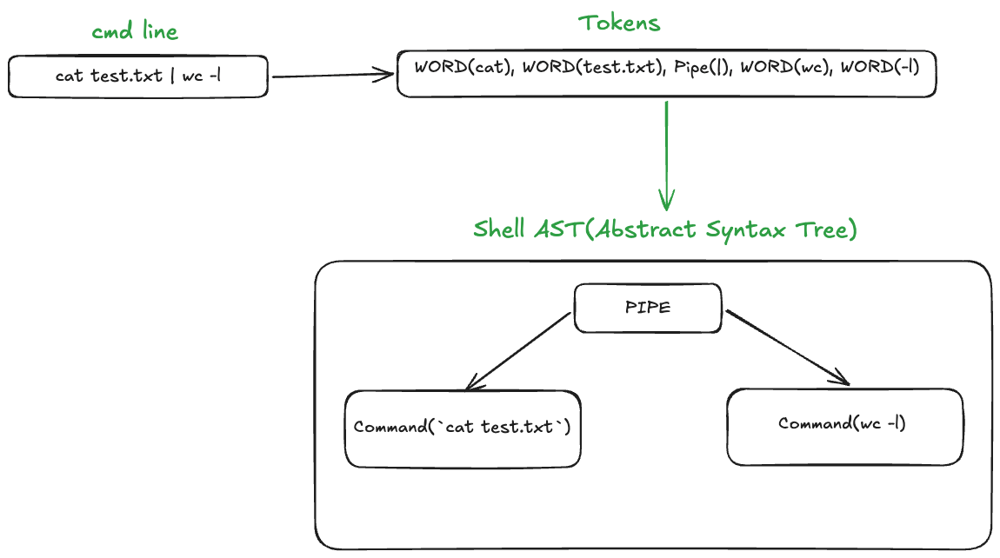
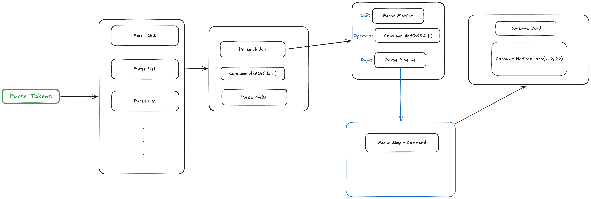
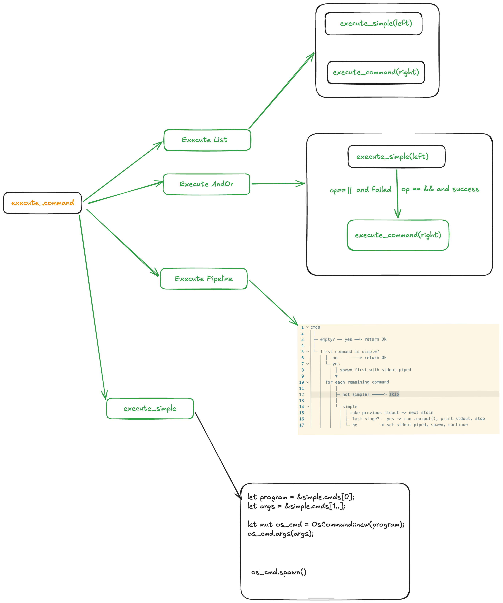
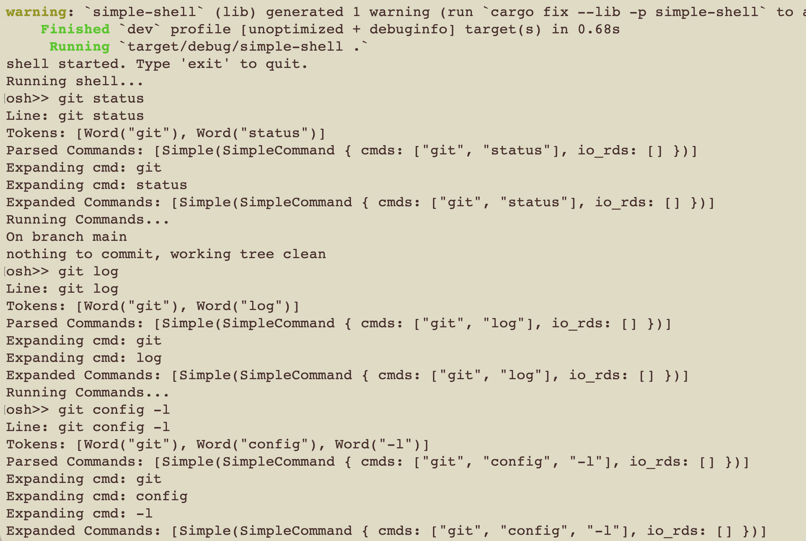
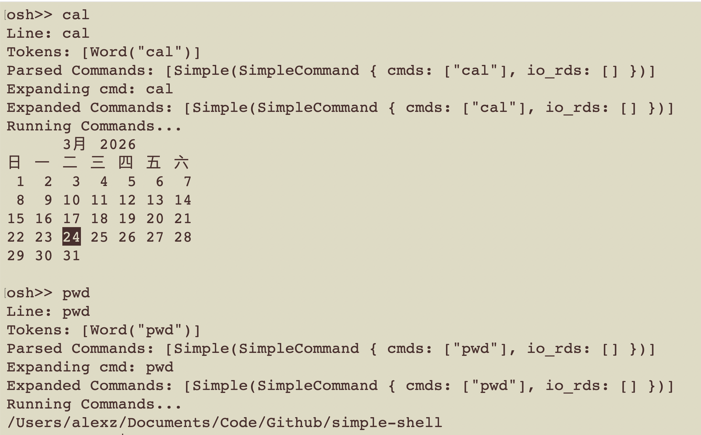
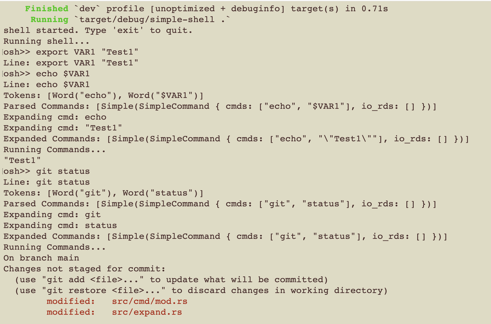
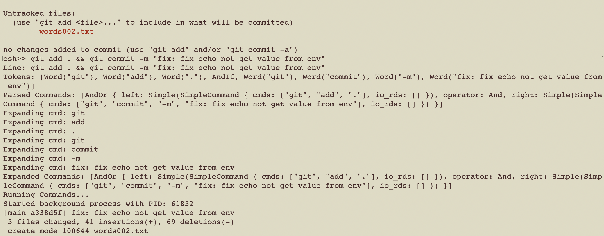
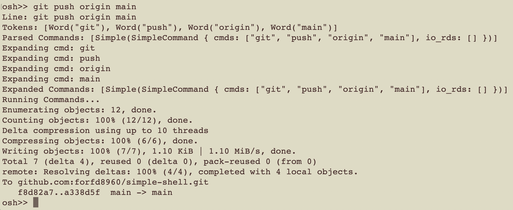

In this tutorial, we will build a simple shell using Rust. The command-line shell serves as the primary interface between the user and the operating system kernel, acting as both a command executor and a programming environment. By creating our own shell, we can gain a deeper understanding of how command-line interfaces work and how to interact with the operating system.

<!-- truncate -->


## The History of Shell Development

The evolution of the command-line shell is inextricably linked to the history of the Unix operating system and the broader evolution of human-computer interaction. Below is a chronological summary of its development:


### The 1970s: The Foundations
*   **Thompson Shell (1971):** Created by **Ken Thompson** for the first version of Unix. It established the fundamental syntax for **I/O redirection** (`<` and `>`) and the implementation of **pipes** (`|`). In this era, complex tasks like wildcard expansion were not handled by the shell itself, but by external utilities like `/etc/glob`.
*   **Bourne Shell (`sh`, 1979):** Developed by **Stephen Bourne** in the 7th Edition of Unix. It marked a paradigm shift by integrating wildcard expansion (globbing) directly into the binary and introducing a **robust scripting language** with control structures like `if`, `for`, and `while`. 
*   **C Shell (`csh`):** Developed concurrently by **Bill Joy** at UC Berkeley to appeal to C programmers. It introduced major **interactive enhancements** such as command history, aliases, and job control.

### The 1980s: The "Shell Wars" and Standardization
*   **Korn Shell (`ksh`):** Developed by **David Korn**, this shell attempted to merge the advanced scripting prowess of the Bourne shell with the interactive features of the C shell.
*   **Bash (Bourne Again Shell):** Created by **Brian Fox** for the GNU Project. It emerged as a free, open-source implementation that adhered to **POSIX standards** and eventually became the default shell on most Linux distributions.

### The 1990s: Advanced Customization
*   **Zsh:** Developed by **Paul Falstad** as a sophomore project at Princeton. Originally intended as a subset of the C shell for the Amiga, it expanded to incorporate features from `ksh` and `tcsh`. It became famous for its **advanced completion and deep customizability**, eventually replacing Bash as the default shell on macOS in 2019.

### The 2000s: User-Centric Design
*   **Fish (Friendly Interactive Shell):** Created by **Axel Liljencrantz**. Fish intentionally departed from POSIX strictness to focus on usability, providing **syntax highlighting and predictive autosuggestions** as native features out of the box.
*   **PowerShell (2006):** One of the first shells to draw a hard line against traditional Unix text-based pipelines. It introduced a **.NET engine that passed structured objects** between commands instead of plain text, and utilized a strict verb-noun naming convention.

### The 2010s to Present: Structured Data Paradigms
*   **Nushell:** Developed by **Yehuda Katz and others**, Nushell challenges the Unix "everything is a string" philosophy by treating pipeline data as **structured objects**. It acts as a fully-typed scripting language and data processing system, allowing users to pattern match and perform SQL-like queries on tables and records directly within the shell environment.

## Building a Simple Shell in Rust

In this section, we will walk through the process of building a simple shell using Rust. This shell will be capable of executing basic commands, handling input and output, and providing a foundation for more advanced features.

### The Features our simple shell will include:

*   **Command Execution:** The ability to execute basic commands like `ls`, `echo`, and `pwd`.
*   **Built-in Commands:** Support for built-in commands such as `cd` and `exit`.
*   **Async and Sequential Execution:** The ability to execute commands both synchronously and asynchronously using `&`.
*   **Input/Output Redirection:** Support for redirecting input and output using `>` and `<`.
*   **Pipelines:** The ability to chain commands together using `|`.


### Step 1: Setting Up the Project

First, we need to create a new Rust project. Open your terminal and run the following command:

```bash
cargo new simple-shell
cd simple-shell
```

and create the following module:

```bash
➜  simple-shell git:(02c2673) tree src
src
├── cmd
│   └── mod.rs
├── errors.rs
├── ioloop
│   └── mod.rs
├── lib.rs
├── main.rs
└── state.rs
```

- `cmd` will contain the logic for parsing and executing commands.
- `errors` will define custom error types for our shell.
- `ioloop` will implement the main REPL loop.
- `state` will manage the shell's state, such as environment variables and the current working directory.

### Step2: Implement built-in commands

First we will implement some built-in commands such as `cd` and `exit`. These commands will be handled directly by the shell without spawning a new process.

```rust
pub fn run_cmd(cmd: &str, state: &mut ShellState) -> Result<(), ShellErrors>   {
    if let Some(builtin) = parse_builtin_cmd(cmd) {
        return run_builtin_cmd(builtin, state);
    }

    Err(ShellErrors::NotSupportedCmd(cmd.to_string()))
}
```

- parse_builtin_cmd will check if the command is a built-in command and return it if it is.

```rust
fn parse_builtin_cmd(cmd: &str) -> Option<BuiltIn> {
    let parts: Vec<&str> = cmd.split_whitespace().collect();
    match parts[0] {
        "cd" => Some(BuiltIn::Cd(parts[1].to_string())),
        "export" => Some(BuiltIn::Export(parts[1].to_string(), parts[2].to_string())),
        "unset" => Some(BuiltIn::Unset(parts[1].to_string())),
        "set" => Some(BuiltIn::Set(parts[1].to_string(), parts[2].to_string())),
        "readonly" => Some(BuiltIn::ReadOnly(parts[1].to_string(), parts[2].to_string())),
        "exec" => Some(BuiltIn::Exec(parts[1].to_string(), parts[2..].iter().map(|s| s.to_string()).collect())),
        "eval" => Some(BuiltIn::Eval(parts[1..].join(" "))),
        "exit" => Some(BuiltIn::Exit),
        _ => None,
    }
}
```

- run_builtin_cmd will execute the built-in command based on the type of command.

```rust
pub fn run_builtin_cmd(cmd: BuiltIn, state: &mut ShellState) -> Result<(), ShellErrors> {
    match cmd {
        BuiltIn::Cd(path) => {
            state.change_dir("cd", &path)
        },
        BuiltIn::Export(key, value) => {
            state.set_env_var(key, value);
            Ok(())
        },
        BuiltIn::Unset(key) => {
            state.unset_env_var(&key);
            Ok(())
        },
        BuiltIn::Set(key, value) => {
            state.set_env_var(key, value);
            Ok(())
        },
        BuiltIn::ReadOnly(key, value) => {
            state.set_env_var(key, value);
            Ok(())
        }
        BuiltIn::Exec(cmd, args) => {
            println!("Executing command: {} with args: {:?}", cmd, args);
            Ok(())
        },
        BuiltIn::Eval(cmd) => {
            println!("Evaluating command: {}", cmd);
            Ok(())
        },
        BuiltIn::Exit => {
            println!("Exiting shell...");
            std::process::exit(0);
        }
    }
}
```

- Shell State will manage the current working directory, environment variables, command history, and exit code.

```rust
pub struct ShellState {
    pub current_dir: PathBuf,
    pub env_vars: HashMap<String, String>,
    pub cmd_history: Vec<String>,
    pub exit_code: i32,
}

impl ShellState {
    pub fn new() -> Self {
        Self {
            current_dir: std::env::current_dir().unwrap(),
            env_vars: std::env::vars().collect(),
            cmd_history: Vec::new(),
            exit_code: 0,
        }
    }

    pub fn set_env_var(&mut self, key: String, value: String) {
        self.env_vars.insert(key, value);
    }

    pub fn unset_env_var(&mut self, key: &str) {
        self.env_vars.remove(key);
    }

    pub fn get_env_var(&self, key: &str) -> Option<&String> {
        self.env_vars.get(key)
    }

    pub fn append_history(&mut self, cmd: String) {
        self.cmd_history.push(cmd);
    }

    // change current directory
    // 1. if the path is absolute, change to that path
    // 2. if the path is relative, change to that path relative to current directory
    pub fn change_dir(&mut self, cmd: &str, path: &str) -> Result<(), ShellErrors> {
        let new_path = if PathBuf::from(path).is_absolute() {
            PathBuf::from(path)
        } else {
            self.current_dir.join(path)
        };

        // check the new path exists and is a directory
        if new_path.exists() && new_path.is_dir() {
            self.current_dir = new_path;
            return Ok(());
        }

        Err(ShellErrors::CmdError(cmd.to_string(), format!("No such directory: {}", path)))
    }
}
```

```bash
simple-shell git:(ce2b36f) ✗ cargo run .
Hello, world!
Running shell...
osh>> export VAR1 "X1"
Line: export VAR1 "X1"
Set env var: VAR1="X1"
get VAR1: Some("\"X1\"")
osh>> exit
Line: exit
Exiting shell...

➜  simple-shell git:(ce2b36f) ✗ cargo run .                                          
Hello, world!
Running shell...
osh(/Users/alexz/Documents/Code/Github/simple-shell)>> cd src
Line: cd src
osh(/Users/alexz/Documents/Code/Github/simple-shell/src)>>
```

### Step3: Lexer and Parse the Command line into Shell AST.

So according my research and understanding, the shell operates through a continuous **Read-Eval-Print Loop (REPL)**. It begins by reading user input from a terminal or file, breaking the input into tokens (lexical analysis), and parsing them into a structured command tree. 



- Tokens

```rust
#[derive(Debug, Clone, PartialEq)]
pub enum Token {
    Word(String),
    AndIf,     // &&
    OrIf,      // ||
    Pipe,      // |
    Semicolon, // ;
    Ampersand, // &
    Less,      // <
    Greater,   // >
    DGreater,  // >>
}
```

- Lexer cmd line into tokens.

```rust
pub fn lex_words(cmd_line: &str) -> Vec<String> {
    let lexwords = shell_words::split(cmd_line).unwrap_or_else(|e| {
        eprintln!("Error parsing command line: {}", e);
        Vec::new()
    });
    lexwords
}

pub fn parse_words(words: Vec<String>) -> Vec<Token> {
    let mut tokens = Vec::new();
    for word in words {
        match word.as_str() {
            "&&" => tokens.push(Token::AndIf),
            "||" => tokens.push(Token::OrIf),
            "|" => tokens.push(Token::Pipe),
            ";" => tokens.push(Token::Semicolon),
            "&" => tokens.push(Token::Ampersand),
            "<" => tokens.push(Token::Less),
            ">" => tokens.push(Token::Greater),
            ">>" => tokens.push(Token::DGreater),
            _ => tokens.push(Token::Word(word)),
        }
    }
    tokens
}
```

- Command

```rust
/// `Command` 枚举代表了 Shell 语法树中的任意一种命令结构 [2]
#[derive(Debug, Clone)]
pub enum Command {
    /// 顺序执行或后台执行的列表，由 `;` 或 `&` 连接 [3, 9]
    List {
        left: Box<Command>,
        separator: ListSeparator,
        right: Box<Command>,
    },

    /// AND-OR 列表，由 `&&` 或 `||` 连接的命令 [3]
    AndOr {
        left: Box<Command>,
        operator: LogicalOp,
        right: Box<Command>,
    },

    /// 管道命令，由多个子命令通过 `|` 连接，例如 `cmd1 | cmd2` [6, 8]
    Pipeline(Vec<Command>),

    /// 简单命令，例如 `ls -l > out.txt` [6, 7]
    Simple(SimpleCommand),
}

// ---------------------------------------------------------
// 简单命令的具体定义
// ---------------------------------------------------------

/// `SimpleCommand` 包含一个基础命令的所有元素 [7]
#[derive(Debug, Clone)]
pub struct SimpleCommand {
    pub cmds: Vec<String>,        // 命令及其参数列表，例如 ["ls", "-l"] [7]
    pub io_rds: Vec<Redirection>, // 该命令的所有 I/O 重定向操作 [16, 17]
}

/// 逻辑操作符 [3, 4]
#[derive(Debug, Clone, PartialEq)]
pub enum LogicalOp {
    And, // &&
    Or,  // ||
}

/// 列表分隔符 [3, 15]
#[derive(Debug, Clone, PartialEq)]
pub enum ListSeparator {
    Sequential, // ; (前台顺序执行)
    Async,      // & (放入后台子 Shell 异步执行) [9]
}

// ---------------------------------------------------------
// 重定向操作的具体定义
// ---------------------------------------------------------

/// 表示 I/O 重定向操作，如 `2> error.log` 或 `< input.txt` [16, 17]
#[derive(Debug, Clone)]
pub struct Redirection {
    /// 可选的源文件描述符 (例如 `2>...` 中的 2) [17]
    /// 如果未指定，默认输入为 0，输出为 1 [18, 19]
    pub fd: Option<i32>,

    /// 重定向操作符类型
    pub operator: RedirectOp,

    /// 目标文件名或目标文件描述符 (例如 `&1`) [17-19]
    pub target: String,
}

/// 支持的重定向操作符类型 [17, 20]
#[derive(Debug, Clone, PartialEq)]
pub enum RedirectOp {
    Input,  // <  [21]
    Output, // >  [21]
    Append, // >> [22]
}

pub struct Parser {
    pub tokens: Vec<Token>,
    pub current_pos: usize,
}
```

- Prase Tokens into Command AST.

So to parse the tokens into a command AST, we will implement a recursive descent parser. The parser will have methods for parsing different levels of the command structure, such as `parse_command`, `parse_pipeline`, `parse_and_or`, and `parse_list`. Each method will consume tokens and build the corresponding part of the AST.

the  EBNF grammar for our shell commands can be defined as follows:

```bash
list: and_or ((';' | '&') and_or)*  # 
and_or: pipeline (('&&' | '||') pipeline)*
pipeline: command ('|' command)*
command: simple_command | subshell
simple_command: cmd_elements io_redirections*
cmd_elements: WORD cmd_elements?
io_redirections: io_redirect io_redirections?
io_redirect: [n] ('<' | '>' | '>>') WORD
```

Parser implementation:




### Step4: Expand the Command AST

now we have parsed the command line into a command AST, we need to expand the command AST by performing word expansions (such as environment variables and wildcards) and setting up any required I/O redirections and pipes.

for rust, we can use the `glob` crate for wildcard expansion and the `regex` to check if the command contains wildcard patterns. We can also use the `shellexpand` crate to perform environment variable expansion.

```rust
use glob::glob;
use regex::Regex;

use crate::{Command, ListSeparator, SimpleCommand};

pub fn expand_commands(commands: Vec<Command>) -> Vec<Command> {
    let mut new_commands: Vec<Command> = Vec::new();
    for cmd in commands {
        match cmd {
            Command::AndOr {
                left,
                operator,
                right,
            } => {
                let new_l_r = expand_commands(vec![*left, *right]);

                new_commands.push(Command::AndOr {
                    left: Box::new(new_l_r[0].clone()),
                    operator,
                    right: Box::new(new_l_r[1].clone()),
                });
            }
            Command::List {
                left,
                separator,
                right,
            } => {
                let new_l_r = if right.is_some() {
                    expand_commands(vec![*left, *right.unwrap()])
                } else {
                    expand_commands(vec![*left])
                };

                new_commands.push(expand_list(separator, new_l_r));
            }

            Command::Pipeline(cmds) => {
                new_commands.push(Command::Pipeline(expand_commands(cmds)));
            }

            Command::Simple(cmd) => {
                new_commands.push(expand_simple(cmd));
            }
        }
    }

    new_commands
}

fn expand_list(op: ListSeparator, new_l_r: Vec<Command>) -> Command {
    let right = if new_l_r.len() >= 2 {
        Some(Box::new(new_l_r[1].clone()))
    } else {
        None
    };

    Command::List {
        left: Box::new(new_l_r[0].clone()),
        separator: op,
        right,
    }
}

fn expand_simple(simple: SimpleCommand) -> Command {
    let expand_cmds = simple
        .cmds
        .iter()
        .map(|cmd| shellexpand::full(cmd).unwrap().to_string())
        .collect::<Vec<String>>();

    Command::Simple(SimpleCommand {
        cmds: expand_path(expand_cmds),
        io_rds: simple.io_rds,
    })
}

fn expand_path(expand_cmds: Vec<String>) -> Vec<String> {
    let mut new_cmds = Vec::new();

    for cmd in expand_cmds {
        let cmd_str = cmd.as_str();
        if is_glob_pattern(cmd_str) {
            for path in glob(cmd_str).unwrap().filter_map(Result::ok) {
                println!("{}", path.display());
                new_cmds.push(path.to_string_lossy().to_string());
            }
        } else {
            new_cmds.push(cmd);
        }
    }

    new_cmds
}
```

After expand, the arguments of the command will be expanded to the actual file paths if they contain wildcard patterns, and the environment variables will be expanded to their values.

```rust
#[test]
    // grep -rl "tests" src/*.rs
    fn test_expand_glob1() {
        let sim = expand_simple(SimpleCommand {
            cmds: r#"grep -rl "tests" src/*.rs"#.split(" ").map(|w| w.to_string()).collect(),
            io_rds: vec![],
        });

        assert_eq!(
            sim,
            Command::Simple(SimpleCommand {
                cmds: vec![
                    "grep".to_string(),
                    "-rl".to_string(),
                    "\"tests\"".to_string(),
                    "src/errors.rs".to_string(),
                    "src/expand.rs".to_string(),
                    "src/lib.rs".to_string(),
                    "src/main.rs".to_string(),
                    "src/parser.rs".to_string(),
                    "src/state.rs".to_string(),
                ],
                io_rds: vec![],
            })
        );
    }
```

### Step5: Execute the Command AST










## Code

[Simple Shell](https://github.com/forfd8960/simple-shell)


## Summary

At its core, the shell operates through a continuous **Read-Eval-Print Loop (REPL)**.

* It begins by reading user input from a terminal or file, breaking the input into tokens (lexical analysis), and parsing them into a structured command tree.

* Next, it evaluates the command by performing necessary word expansions (such as environment variables and wildcards) and setting up any required I/O redirections and pipes.

* Finally, the shell executes the command: if it is an internal built-in command, the shell runs it directly; if it is an external program, the shell utilizes the fork-exec paradigm to spawn a new child process to run the executable, while the parent shell typically waits for the child to finish and collects its exit status before displaying the next prompt.