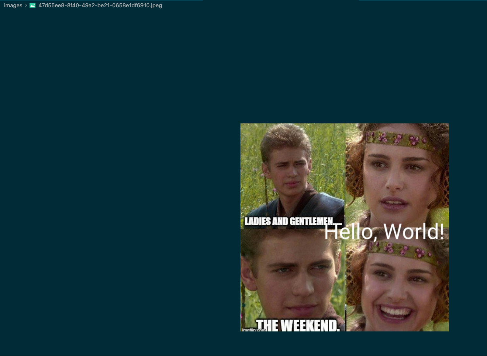

# Build the Image Edit Backend with `Axum`

## Dependency

```toml
[package]
name = "brushbloom"
version = "0.1.0"
edition = "2024"

[dependencies]
photon-rs = "0.3.3"
anyhow = "1.0.97"
axum = { version = "0.8.4", features = [
    "http2",
    "query",
    "tracing",
    "multipart",
    "macros",
    "ws"
]}
thiserror = "2.0.16"
tokio = { version = "1.47.1", features = ["rt", "rt-multi-thread", "macros", "fs"] }
tokio-util = { version = "0.7.16", features = ["io"] }
tracing = "0.1.41"
tracing-subscriber = { version = "0.3.20", features = ["env-filter"] }
serde = { version = "1.0.225", features = ["derive"] }
serde_json = "1.0.145"
bytes = "1.7"
tempfile = "3.22.0"
toml = {version = "0.9.6", features = ["serde"] }
uuid = {version = "1.18.1", features = ["v4"] }
```

## Main

```rust
use anyhow::Result;
use brushbloom::{
    router,
    state::{AppConfig, AppState},
};
use std::path::Path;
use tokio::net::TcpListener;
use tracing::{info, level_filters::LevelFilter};
use tracing_subscriber::{Layer as _, fmt::Layer, layer::SubscriberExt, util::SubscriberInitExt};

#[tokio::main]
async fn main() -> Result<()> {
    let layer = Layer::new().with_filter(LevelFilter::INFO);
    tracing_subscriber::registry().with(layer).init();

    let app_conf = AppConfig::new("config.toml")?;

    let upload_dir = app_conf.file_path.clone();
    if !Path::new(&upload_dir).exists() {
        tokio::fs::create_dir(upload_dir).await?;
    }

    let meta_path = app_conf.meta_path.clone();
    if !Path::new(&meta_path).exists() {
        tokio::fs::create_dir(meta_path).await?;
    }

    let app_state = AppState::new(app_conf);
    info!("app_state: {:?}", app_state);

    let app = router::routers(app_state)?;
    let listener = TcpListener::bind("0.0.0.0:8080").await?;

    axum::serve(listener, app).await?;
    Ok(())
}
```

## Routers (routers.rs)

```rust
use anyhow::Result;
use axum::{
    Router,
    routing::{get, post},
};

use crate::{
    handlers::image::{
        compress_image, crop_image, get_image, resize_img, upload_image, watermark_image,
    },
    state::AppState,
};

pub fn routers(app_state: AppState) -> Result<Router> {
    let router = Router::new()
        .route("/api/images/upload", post(upload_image))
        .route("/api/images/{img_id}", get(get_image))
        .route("/api/images/{img_id}/watermark", post(watermark_image))
        .route("/api/images/{img_id}/resize", post(resize_img))
        .route("/api/images/{img_id}/compress", post(compress_image))
        .route("/api/images/{img_id}/crop", post(crop_image))
        .with_state(app_state);

    Ok(router)
}

```

## App State(state.rs)

```rust
use anyhow::{Result, anyhow};
use bytes::BytesMut;
use serde::Deserialize;
use std::{fs::File, io::Read, ops::Deref, sync::Arc};

#[derive(Debug, Clone)]
pub struct AppState {
    pub inner: Arc<AppStateInner>,
}

#[derive(Debug, Clone)]
pub struct AppStateInner {
    pub conf: AppConfig,
}

#[derive(Debug, Clone, Deserialize)]
pub struct AppConfig {
    pub max_file_size: u64,
    pub file_path: String,
    pub meta_path: String,
}

impl AppConfig {
    pub fn new(path: &str) -> Result<Self> {
        let mut file = File::open(path)?;
        let mut buf = BytesMut::with_capacity(4096).to_vec();
        let _ = file.read_to_end(&mut buf)?;

        match toml::from_slice(&buf) {
            Ok(v) => Ok(v),
            Err(e) => return Err(anyhow!("{}", e)),
        }
    }
}

impl AppState {
    pub fn new(config: AppConfig) -> Self {
        Self {
            inner: Arc::new(AppStateInner { conf: config }),
        }
    }
}

impl Deref for AppState {
    type Target = AppStateInner;
    fn deref(&self) -> &Self::Target {
        &self.inner
    }
}

```

## Handler Implementation

### image moduele

```rust
pub mod image;

use anyhow::{Result, anyhow};
use photon_rs::{PhotonImage, native::save_image, text::draw_text, transform::resize};
use serde::{Deserialize, Serialize};
use std::path::PathBuf;
use uuid::Uuid;

#[derive(Serialize, Deserialize)]
pub struct ImgMetadata {
    pub fmt: String,
    pub size_in_bytes: u32,
}

#[derive(Serialize)]
pub struct ErrorResponse {
    error: String,
}

#[derive(Serialize)]
struct FileResponse {
    id: String,
    fmt: String,
}

#[derive(Debug, Deserialize)]
pub struct WatermarkRequest {
    text: String,
    position: String,
    font_size: u32,
}

#[derive(Debug, Serialize)]
struct WatermarkResponse {
    new_img_id: String,
}

#[derive(Debug, Deserialize)]
pub struct ResizeImageRequest {
    width: u32,
    height: u32,
    maintain_aspect: bool,
}

#[derive(Debug, Serialize)]
pub struct ResizeImageResponse {
    new_img_id: String,
}

#[derive(Debug, Deserialize)]
pub struct CompressImageRequest {
    quality: u8, // 0-100
}

#[derive(Debug, Serialize)]
pub struct CompressImageResponse {
    new_img_id: String,
}

#[derive(Debug, Deserialize)]
pub struct CorpImageRequest {
    x: u32,
    y: u32,
    width: u32,
    height: u32,
}

#[derive(Debug, Serialize)]
pub struct CorpImageResponse {
    new_img_id: String,
}

// Helper function to add watermark
fn add_watermark_to_image(image: &mut PhotonImage, text: &str, position: &str, font_size: u32) {
    // Determine position coordinates (simplified for example)
    let (x, y) = match position {
        "top-left" => (10, 10),
        "center" => (image.get_width() / 2 - 50, image.get_height() / 2 - 20),
        "bottom-right" => (image.get_width() - 100, image.get_height() - 40),
        _ => (10, 10), // Default to top-left
    };

    // Apply the watermark (photon-rs draw_text applies text with a default font style)
    draw_text(
        image,
        text,
        x as i32,
        y as i32,
        font_size as f32, // photon-rs expects f32 for font size
    );
}

fn resize_image(
    image: &mut PhotonImage,
    width: Option<u32>,
    height: Option<u32>,
    maintain_aspect: bool,
) -> Result<PhotonImage> {
    // Get original dimensions
    let orig_width = image.get_width();
    let orig_height = image.get_height();

    // Determine new dimensions
    let (new_width, new_height) = match (width, height, maintain_aspect) {
        (Some(w), Some(h), false) => (w, h), // Exact dimensions, ignore aspect ratio
        (Some(w), None, _) => {
            // Resize based on width, maintain aspect ratio
            let ratio = w as f32 / orig_width as f32;
            (w, (orig_height as f32 * ratio).round() as u32)
        }
        (None, Some(h), _) => {
            // Resize based on height, maintain aspect ratio
            let ratio = h as f32 / orig_height as f32;
            ((orig_width as f32 * ratio).round() as u32, h)
        }
        (Some(w), Some(h), true) => {
            // Maintain aspect ratio, fit within width and height
            let width_ratio = w as f32 / orig_width as f32;
            let height_ratio = h as f32 / orig_height as f32;
            let ratio = width_ratio.min(height_ratio);
            (
                (orig_width as f32 * ratio).round() as u32,
                (orig_height as f32 * ratio).round() as u32,
            )
        }
        (None, None, _) => {
            return Err(anyhow!("At least one of width or height must be specified"));
        }
    };

    // Resize the image using Lanczos3 filter for high quality
    let resized_image = resize(
        image,
        new_width,
        new_height,
        photon_rs::transform::SamplingFilter::Lanczos3,
    );

    Ok(resized_image)
}

fn save_new_iamge(file_path: &str, img_meta: &ImgMetadata, img: PhotonImage) -> Result<String> {
    let new_image_id = Uuid::new_v4().to_string();
    let output_path = PathBuf::from(format!("{}/{}{}", file_path, new_image_id, img_meta.fmt));

    // Save the modified image
    match save_image(img, output_path.to_str().unwrap()) {
        Err(e) => return Err(anyhow!("Failed to save image: {}", e)),
        Ok(_) => Ok(new_image_id),
    }
}

```

### Upload Image

```rust
pub async fn upload_image(State(state): State<AppState>, mut mp: Multipart) -> impl IntoResponse {
    let mut file_name = String::new();
    let mut file_data = Vec::new();
    let mut image_type = String::new();

    // Process multipart form data
    while let Some(field) = mp.next_field().await.unwrap_or(None) {
        let field_name = field.name().map(|s| s.to_string());
        info!("field_name: {:?}", field_name);

        match field_name.as_deref() {
            Some("file") => {
                file_name = field
                    .file_name()
                    .map(|s| s.to_string())
                    .unwrap_or_else(|| format!("images-{}", Uuid::new_v4().to_string()));

                image_type = field.content_type().unwrap().to_string();
                info!("uploading file: {}", file_name);

                match field.bytes().await {
                    Ok(data) => file_data = data.to_vec(),
                    Err(_) => {
                        return (
                            StatusCode::BAD_REQUEST,
                            Json(ErrorResponse {
                                error: "Failed to read file data".to_string(),
                            }),
                        )
                            .into_response();
                    }
                }
            }
            _ => {} // Ignore other fields
        }
    }

    info!("file_name: {}", file_name);
    info!("file_data length: {}", file_data.len());

    if file_name.is_empty() || file_data.is_empty() {
        return (
            StatusCode::BAD_REQUEST,
            Json(ErrorResponse {
                error: "Missing file or filename".to_string(),
            }),
        )
            .into_response();
    }

    write_file(&state, image_type, file_data)
}
```

### Write File

```rust
fn write_file(state: &AppState, image_type: String, file_data: Vec<u8>) -> Response<Body> {
    let fp = &state.conf.file_path;
    let image_format = detect_image_format(image_type);

    // Generate unique ID and file path
    let file_id = Uuid::new_v4().to_string();
    let file_path = PathBuf::from(format!("{}/{}{}", fp, file_id, image_format.as_str()));

    // Save file to disk
    match File::create(&file_path) {
        Ok(mut file) => {
            info!("writing data to file: {:?}", file_path);

            if let Err(_) = file.write_all(&file_data) {
                return build_err_response(
                    StatusCode::INTERNAL_SERVER_ERROR,
                    "Failed to save file".to_string(),
                );
            }
        }
        Err(e) => {
            warn!("failed create file: {}", e);
            return build_err_response(
                StatusCode::INTERNAL_SERVER_ERROR,
                "Failed to create file".to_string(),
            );
        }
    }

    // Save metadata
    let meta = ImgMetadata {
        fmt: image_format.as_str().to_string(),
        size_in_bytes: file_data.len() as u32,
    };
    let meta_path = PathBuf::from(format!("{}/{}", &state.conf.meta_path, file_id));

    match File::create(&meta_path) {
        Ok(mut meta_file) => {
            let meta_json = serde_json::to_vec(&meta).unwrap();
            if let Err(_) = meta_file.write_all(meta_json.as_slice()) {
                return build_err_response(
                    StatusCode::INTERNAL_SERVER_ERROR,
                    "Failed to save metadata".to_string(),
                );
            }
        }
        Err(e) => {
            warn!("failed create meta file: {}", e);
            return build_err_response(
                StatusCode::INTERNAL_SERVER_ERROR,
                "Failed to create metadata file".to_string(),
            );
        }
    }

    info!("success upload file to: {:?}, {}", file_path, file_id);
    (
        StatusCode::CREATED,
        Json(FileResponse {
            id: file_id,
            fmt: image_format.as_str().to_string(),
        }),
    )
        .into_response()
}

```

### Watermark Image Handler

```rust
pub async fn watermark_image(
    State(state): State<AppState>,
    Path(img_id): Path<String>,
    Json(watermk_req): Json<WatermarkRequest>,
) -> impl IntoResponse {
    info!("watermark request: {:?}", watermk_req);

    let photon_img_res = read_image(&state, &img_id).await;
    if photon_img_res.is_err() {
        return photon_img_res.err().unwrap();
    }

    let (mut photon_img, img_meta) = photon_img_res.unwrap();

    add_watermark_to_image(
        &mut photon_img,
        &watermk_req.text,
        &watermk_req.position,
        watermk_req.font_size,
    );

    // Generate new image ID
    let file_path = &state.conf.file_path;
    let new_image_id = save_new_iamge(file_path, &img_meta, photon_img);
    if new_image_id.is_err() {
        return build_err_response(
            StatusCode::INTERNAL_SERVER_ERROR,
            new_image_id.err().unwrap().to_string(),
        );
    }

    // Return response
    let response = WatermarkResponse {
        new_img_id: new_image_id.unwrap(),
    };

    (StatusCode::OK, Json(response)).into_response()
}
```

### Resize Image

```rust
pub async fn resize_img(
    State(state): State<AppState>,
    Path(img_id): Path<String>,
    Json(req): Json<ResizeImageRequest>,
) -> impl IntoResponse {
    info!("resize request: {:?}", req);

    let file_path = &state.conf.file_path;
    info!("reading image from: {}", file_path);

    let (mut photon_img, img_meta) = match read_image(&state, &img_id).await {
        Ok(v) => v,
        Err(e) => return e,
    };

    let new_image_id = Uuid::new_v4().to_string();
    let new_img_res = resize_image(
        &mut photon_img,
        Some(req.width),
        Some(req.height),
        req.maintain_aspect,
    );

    if new_img_res.is_err() {
        return build_err_response(
            StatusCode::INTERNAL_SERVER_ERROR,
            new_img_res.err().unwrap().to_string(),
        );
    }

    let output_path = PathBuf::from(format!("{}/{}{}", file_path, new_image_id, img_meta.fmt));

    let new_img = new_img_res.unwrap();
    let save_res = save_image(new_img, output_path);
    if save_res.is_err() {
        return build_err_response(
            StatusCode::INTERNAL_SERVER_ERROR,
            save_res.err().unwrap().to_string(),
        );
    }

    let response = ResizeImageResponse {
        new_img_id: new_image_id.clone(),
    };

    (StatusCode::OK, Json(response)).into_response()
}
```

### Compress Image handler

```rust

pub async fn compress_image(
    State(state): State<AppState>,
    Path(img_id): Path<String>,
    Json(req): Json<CompressImageRequest>,
) -> impl IntoResponse {
    info!("compress request: {:?}", req);

    let photon_img_res = read_image(&state, &img_id).await;
    if photon_img_res.is_err() {
        return photon_img_res.err().unwrap();
    }

    let (photon_img, img_meta) = photon_img_res.unwrap();
    let compressed_image = compress(&photon_img, req.quality);

    let file_path = &state.conf.file_path;
    let new_image_id = save_new_iamge(file_path, &img_meta, compressed_image);
    if new_image_id.is_err() {
        return build_err_response(
            StatusCode::INTERNAL_SERVER_ERROR,
            new_image_id.err().unwrap().to_string(),
        );
    }

    (
        StatusCode::OK,
        Json(CompressImageResponse {
            new_img_id: new_image_id.unwrap(),
        }),
    )
        .into_response()
}
```

### Crop Image Handler

```rust
pub async fn crop_image(
    State(state): State<AppState>,
    Path(img_id): Path<String>,
    Json(req): Json<super::CorpImageRequest>,
) -> impl IntoResponse {
    info!("crop request: {:?}", req);

    let photon_img_res = read_image(&state, &img_id).await;
    if photon_img_res.is_err() {
        return photon_img_res.err().unwrap();
    }

    let (mut photon_img, img_meta) = photon_img_res.unwrap();

    let cropped_image = crop(&mut photon_img, req.x, req.y, req.width, req.height);

    let file_path = &state.conf.file_path;
    let new_image_id = save_new_iamge(file_path, &img_meta, cropped_image);
    if new_image_id.is_err() {
        return build_err_response(
            StatusCode::INTERNAL_SERVER_ERROR,
            new_image_id.err().unwrap().to_string(),
        );
    }

    (
        StatusCode::OK,
        Json(super::CorpImageResponse {
            new_img_id: new_image_id.unwrap(),
        }),
    )
        .into_response()
}
```

### util functions

```rust

fn build_err_response(code: StatusCode, msg: String) -> Response<Body> {
    (code, Json(ErrorResponse { error: msg })).into_response()
}

async fn read_image(
    state: &AppState,
    img_id: &str,
) -> Result<(PhotonImage, ImgMetadata), Response<Body>> {
    let img_meta_res = get_meta(&state.conf.meta_path, img_id).await;

    if img_meta_res.is_err() {
        return Err(build_err_response(
            StatusCode::INTERNAL_SERVER_ERROR,
            "Failed to read file meta".to_string(),
        ));
    }

    let img_meta = img_meta_res.unwrap();

    let file_path = &state.conf.file_path;
    let full_path = format!("{}/{}{}", file_path, img_id, img_meta.fmt);
    info!("reading: {}", full_path);

    let img_data_res = get_img_data(&full_path).await;
    if img_data_res.is_err() {
        return Err(build_err_response(
            StatusCode::INTERNAL_SERVER_ERROR,
            "Failed to read image".to_string(),
        ));
    }

    Ok((
        PhotonImage::new_from_byteslice(img_data_res.unwrap()),
        img_meta,
    ))
}

async fn get_meta(meta_path: &str, img_id: &str) -> Result<ImgMetadata> {
    let p = format!("{}/{}", meta_path, img_id);

    match tokio::fs::read(p).await {
        Ok(data) => serde_json::from_slice(&data).map_err(|e| anyhow!("{}", e)),
        Err(e) => Err(anyhow!("{}", e)),
    }
}

async fn get_img_data(img_path: &str) -> Result<Vec<u8>> {
    match tokio::fs::read(img_path).await {
        Ok(data) => Ok(data),
        Err(e) => Err(anyhow!("{}", e)),
    }
}
```

## Test

### Upload


### Watermark




### Resize


### Crop


### Compress


