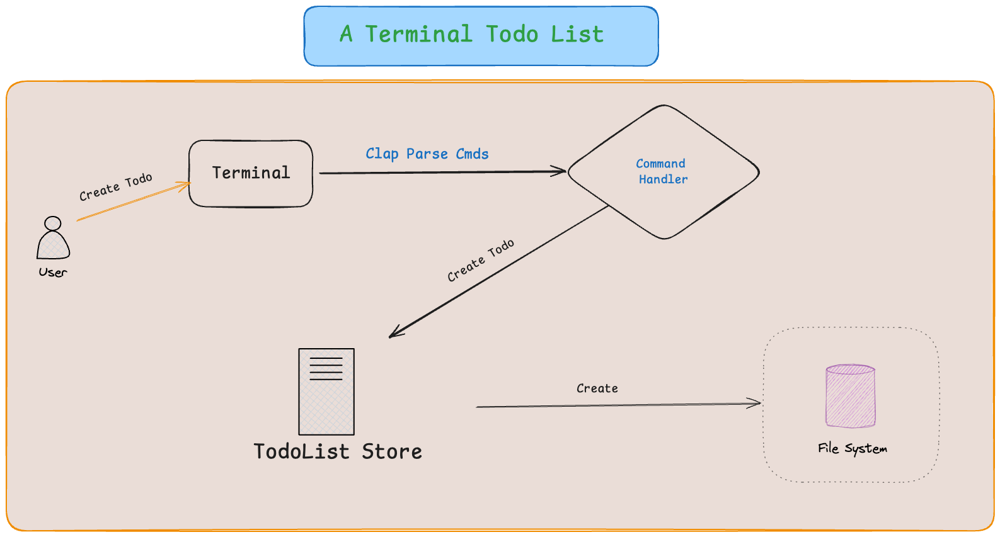

# The Architecture

## The Modules

* command

  the `command` module will build the command line arguments struct with `Clap`.

* handler

  the **handler** module will handle Todo App biz logic by calling `TodoList Store`.

* model

  the **model** module will handle how to create, retrieve, update, delete todo in the file system.
