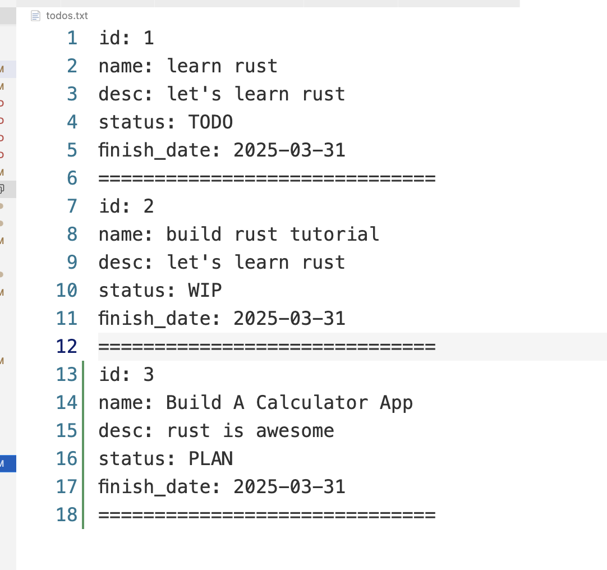
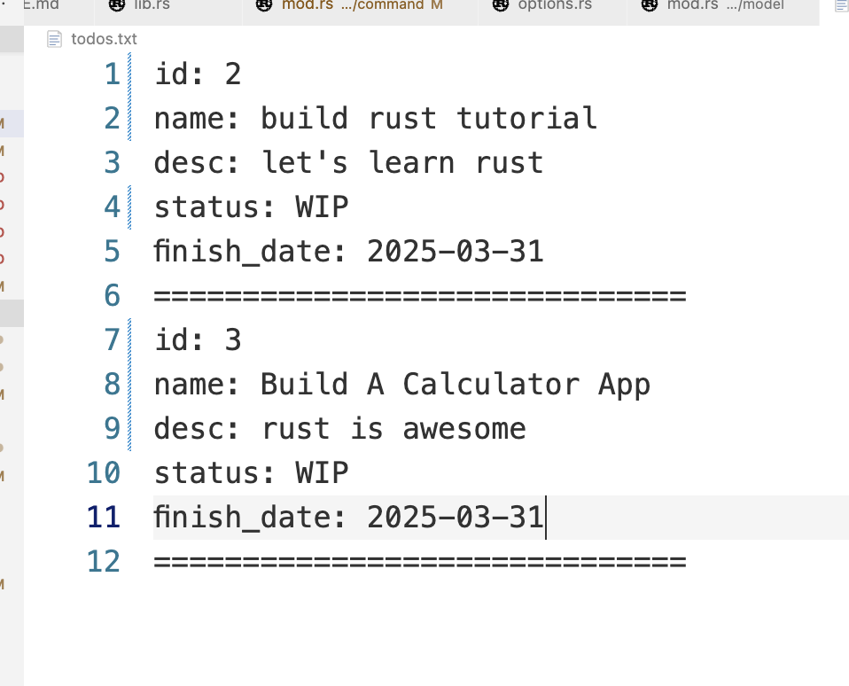

# The Todo Entry Point

```rust
use clap::Parser;
use planner::{
    command::{Command, SubCommand},
    handler::{create_todo, delete_todo, list_todos, update_todo},
    model::TodoStore,
};

fn main() -> Result<(), String> {
    let opts = Command::parse();
    println!("{:?}", opts);

    let mut todo_store = TodoStore::load()?;
    handle_sub_commands(opts, &mut todo_store)
}

fn handle_sub_commands(cmd: Command, todo_store: &mut TodoStore) -> Result<(), String> {
    match cmd.cmd {
        SubCommand::Create(opts) => {
            let todo = create_todo(todo_store, opts)?;
            println!("created todo: {:?}", todo);
            Ok(())
        }
        SubCommand::List(opts) => {
            println!("list todo: {:?}", opts);
            let todos = list_todos(todo_store, opts)?;
            println!("todos: {:?}", todos);
            Ok(())
        }
        SubCommand::Delete(opts) => {
            println!("delete todo: {:?}", opts);
            delete_todo(todo_store, opts)?;
            Ok(())
        }
        SubCommand::Move(opts) => {
            println!("move todo: {:?}", opts);
            let _ = update_todo(todo_store, opts)?;
            Ok(())
        }
    }
}

```

## Run Todo

* List

```sh
~/D/C/g/f/planner (main) [2]> ./target/debug/planner list
Command { cmd: List(ListOpts { sort: None, status: None, finsh_date: None }) }
decode todo str: id: 1
name: learn rust
desc: let's learn rust
status: TODO
finish_date: 2025-03-31

trimmed todo: id: 1
name: learn rust
desc: let's learn rust
status: TODO
finish_date: 2025-03-31
decode todo str:
id: 2
name: build rust tutorial
desc: let's learn rust
status: WIP
finish_date: 2025-03-31

trimmed todo: id: 2
name: build rust tutorial
desc: let's learn rust
status: WIP
finish_date: 2025-03-31
list todo: ListOpts { sort: None, status: None, finsh_date: None }
list todos: ListOpts { sort: None, status: None, finsh_date: None }
todos: [Todo { id: 1, name: "learn rust", desc: "let's learn rust", status: TODO, finish_date: "2025-03-31" }, Todo { id: 2, name: "build rust tutorial", desc: "let's learn rust", status: WIP, finish_date: "2025-03-31" }]
```

* Create

```sh
~/D/C/g/f/planner (main) [2]> ./target/debug/planner create --name "Build A Calculator App" --desc "rust is awesome" --finish-date "2025-03-31"
Command { cmd: Create(CreateOpts { name: "Build A Calculator App", desc: "rust is awesome", finish_date: "2025-03-31" }) }
```



* Move

```sh
~/D/C/g/f/planner (main) [2]> ./target/debug/planner move --id 3 --status WIP
Command { cmd: Move(MoveOpts { id: 3, status: "WIP" }) }

move todo: MoveOpts { id: 3, status: "WIP" }
update todo options: MoveOpts { id: 3, status: "WIP" }
move todo: 3 to: WIP
updated todo: Todo { id: 3, name: "Build A Calculator App", desc: "rust is awesome", status: WIP, finish_date: "2025-03-31" }
```

* Delete

```sh
~/D/C/g/f/planner (main)> ./target/debug/planner delete --id=1
Command { cmd: Delete(DeleteOpts { id: 1 }) }

...

delete todo: DeleteOpts { id: 1 }
delete todo: DeleteOpts { id: 1 }
delete todo: 1
```


